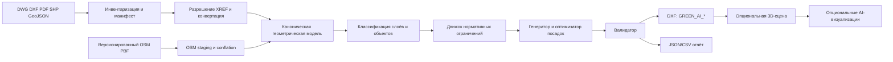

# Архитектура сервиса

## Поток данных



## Компоненты

| Компонент | Ответственность | Не делает |
|---|---|---|
| `project-intake` | создаёт манифест файлов, хеши, версии, граф зависимостей | не угадывает нормативы |
| `cad-adapter` | читает DXF, конвертирует DWG, разворачивает XREF | не меняет оригинал |
| `pdf-adapter` | извлекает вектор/текст, формирует кандидаты геометрии | не считает PDF точной геоподосновой без калибровки |
| `osm-importer` | импортирует зафиксированный PBF в PostGIS staging, выделяет здания и предлагает совмещение | не считает OSM геодезической истиной и не публикует конфликтующие контуры сам |
| `semantic-mapper` | сопоставляет CAD-слои каноническим классам, хранит confidence | не утверждает низкоуверенное сопоставление сам |
| `geometry-core` | CRS, единицы, топология, буферы, пересечения | не знает юридический текст |
| `normative-ingestion` | получает разрешённые редакции, извлекает layout/OCR, индексирует фрагменты и создаёт LLM-кандидаты | не публикует правила и не обходит ограничения доступа к текстам |
| `rulebook` | хранит проверенные параметры правил и их источники | не исполняет LLM-кандидаты до экспертного approval |
| `planning-engine` | строит допустимые зоны и выбирает посадки | не экспортирует CAD |
| `exporter` | создаёт dedicated-слои, блоки и отчётные атрибуты | не переписывает базовые слои |
| `audit` | протоколирует решения и проверки | не скрывает неопределённость |
| `visualization` | читает уже утверждённую модель для 3D/камер | не влияет на посадки |

## Каноническая модель участка

Внутренний формат — GeoJSON-подобные сущности, но не обязательно файл GeoJSON. Координаты хранятся в метрах в `working_crs`; исходные координаты, CAD units и преобразование сохраняются отдельно. Нельзя без доказательства назначать EPSG-код местной CAD-системе.

```json
{
  "feature_id": "cad:source-7:entity-4A2",
  "geometry": {"type": "LineString", "coordinates": [[...], [...]]},
  "semantic_class": "utility.water",
  "semantic_status": "confirmed",
  "source": {
    "file_sha256": "...",
    "source_layer": "ВОДОПРОВОД",
    "source_handle": "4A2",
    "transform_id": "xref:root/2"
  }
}
```

Канонические классы первой версии: `site_boundary`, `building`, `road`, `sidewalk`, `utility.water`, `utility.gas`, `utility.sewer`, `utility.power`, `utility.telecom`, `powerline`, `existing_tree`, `planting_area`, `restricted_area`, `unknown`.

## Контракты артефактов запуска

```text
runs/<run-id>/
  manifest.json                 # входы, хеши, дерево XREF, версии
  external_sources.json         # OSM snapshot/license/config hash и другие внешние наборы
  normalized/scene.geojson      # каноническая сцена
  normalized/layer_mapping.json # решения классификатора + review
  constraints.geojson           # буферы и причины
  output/plan.dxf               # только производный файл
  output/planting_explanations.json
  validation.json
```

`run-id` вычисляется из хешей входов, версии правил, конфига и seed. Повторный запуск не должен зависеть от случайного порядка сущностей.

## Развёртывание

Конверсионный контур сохраняет CLI и специализированные workers. Для проектируемого браузерного рабочего пространства добавляются Next.js и отдельный FastAPI domain API с OpenAPI; они не заменяют очередь конвертации и не получают прямой доступ к каталогам исходной поставки в обход intake/provenance.

Внешний конвертер DWG изолируется в отдельном контейнере/адаптере: лицензирование, версии и ошибки конверсии не должны проникать в геометрическое ядро. Все зависимости запуска совместимы с Linux/МосТех.ОС.

Проектирование пользовательского web-контура, включая разделение Next.js BFF и FastAPI, структуру рабочего пространства и контракты 2D/3D-сцены, вынесено в [отдельное задание](13-web-application-design-brief.md).

Web-клиент не является единственным viewer. Платформа публикует версионированные контракты для нескольких downstream consumers: DXF для CAD, GeoJSON/MVT для 2D/GIS и glTF для внешних 3D-клиентов. В исходном ТЗ прямо указан nanoCAD либо иной DXF-viewer под МосТех.ОС/Linux; FreeCAD в ТЗ не указан и рассматривается только как дополнительный кандидат для проверки. Unreal Engine также может быть отдельным 3D-клиентом. Ни один viewer не получает прямой доступ к PostGIS и не меняет approved revision в обход API/intake.
