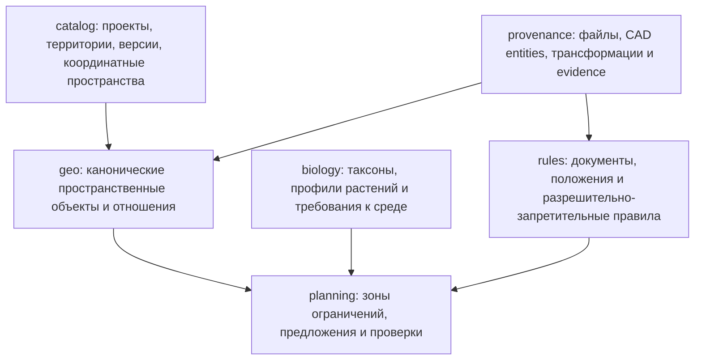
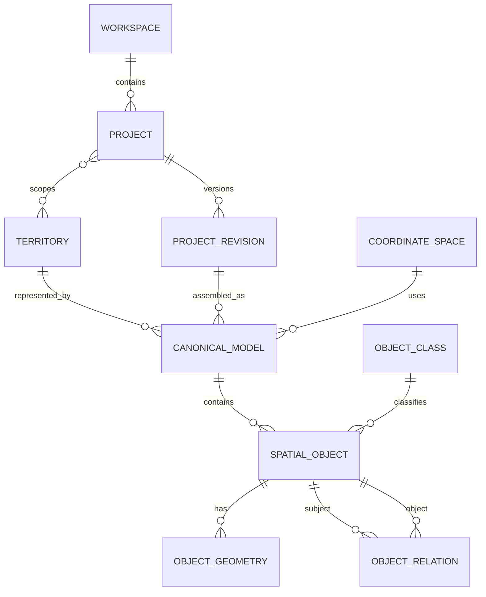
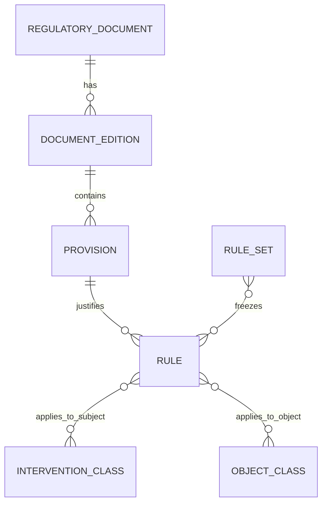
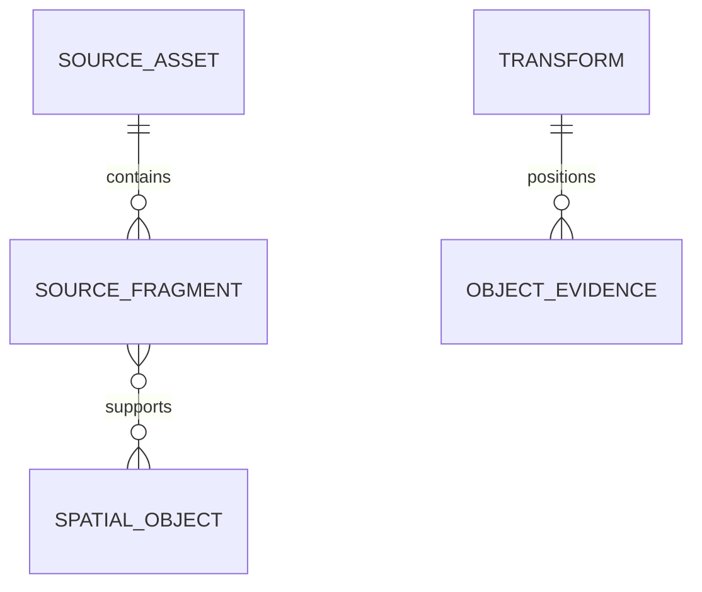

# Предметная модель GreenPlan для PostgreSQL/PostGIS

Этот документ задаёт предметные сущности и отношения. Предлагаемое разбиение на PostgreSQL schemas, физические ключи, жизненные циклы и порядок миграции вынесены в [схему базы данных v1](12-database-schema-v1.md).

## 1. Зачем нужна отдельная предметная модель

Текущая конверсионная БД отвечает на операционный вопрос: какой файл каким инструментом обработан и где лежит производный DXF. Она не должна становиться моделью городской территории.

Предметная модель отвечает на другие вопросы:

- какая территория и версия проекта рассматривается;
- какие реальные и проектируемые объекты находятся на ней;
- как объекты связаны структурно и пространственно;
- какие нормы действуют для конкретного воздействия;
- где и почему дерево, кустарник или травяной покров разрешены, запрещены либо требуют согласования;
- из каких источников получено каждое утверждение.

Файлы, внешние наборы данных, CAD-слои и handles остаются в provenance. Канонический объект не обязан соответствовать одному файлу или одной DXF-сущности: одна сеть может быть собрана из нескольких XREF, а один контур — подтверждён CAD, PDF, ведомостью и версионированным OSM extract.

## 2. Четыре слоя модели



В PostgreSQL это отдельные схемы: `catalog`, `geo`, `biology`, `rules`, `planning`, `provenance`, `audit`. Существующие таблицы конвертера можно временно оставить в `public`, позднее перенести в `intake`.

## 3. Верхний уровень иерархии



### `catalog.workspaces`

Коллекция проектов в рамках контракта, конкурса или заказчика. Текущий workspace — «Пилотный проект 20 улиц».

Ключевые поля: `id`, `code`, `title`, `customer_id`, `status`, `created_at`.

### `catalog.projects`

Административная единица работы: сейчас одна улица, в будущем один объект заказа. Проект не является папкой.

Ключевые поля: `id`, `workspace_id`, `code`, `title`, `project_kind`, `status`, `properties jsonb`.

### `catalog.project_revisions`

Неизменяемая версия входной поставки и её интерпретации. Новая передача подрядчика создаёт новую revision, а не переписывает старую.

Ключевые поля: `id`, `project_id`, `revision_no`, `received_at`, `status`, `content_fingerprint`, `supersedes_id`.

### `catalog.territories`

Реальный пространственный объект верхнего уровня: улица, участок, зона работ или несколько раздельных участков. Геометрия территории версионируется внутри canonical model, поскольку граница работ может уточняться.

Ключевые поля: `id`, `code`, `title`, `territory_kind`, `jurisdiction_id`.

Связь `catalog.project_territories` позволяет одному проекту включать несколько территорий и одной территории участвовать в нескольких ревизиях/этапах.

### `catalog.coordinate_spaces`

Явно описывает систему координат:

- `epsg` — доказанный EPSG/SRID;
- `local_metric` — локальные метры без утверждённого EPSG;
- `cad_local` — CAD-координаты с известными единицами;
- `sheet` — координаты листа, непригодные для пространственного расчёта без трансформации.

Ключевые поля: `id`, `kind`, `srid`, `linear_unit`, `wkt`, `origin`, `transform_to_parent`, `status`, `evidence_id`.

Нельзя выполнять `ST_Distance` между объектами из разных `coordinate_space_id`, даже если PostGIS технически принимает обе геометрии с SRID 0.

### `catalog.canonical_models`

Неизменяемый снимок собранной сцены для одной территории и project revision. Это основной контейнер предметных объектов.

Ключевые поля:

- `id`, `project_revision_id`, `territory_id`, `coordinate_space_id`;
- `model_kind`: `existing`, `design_reference`, `combined`, `generated`;
- `assembly_status`: `draft`, `needs_review`, `approved`, `blocked`;
- `dependency_completeness`, `semantic_coverage`;
- `parent_model_id`, `created_by_run_id`, `created_at`.

Модель после утверждения не меняется. Исправление создаёт новую модель с `parent_model_id`.

## 4. Канонические пространственные объекты

### `geo.object_classes`

Иерархический справочник классов. Для запросов удобно расширение PostgreSQL `ltree`:

```text
territory.work_boundary
structure.building
transport.road.carriageway
transport.road.curb
utility.water.pipeline
utility.gas.pipeline
utility.power.cable
utility.power.overhead
utility.sewer.pipeline
vegetation.existing.tree
vegetation.existing.shrub
vegetation.proposed.tree
surface.lawn
annotation.sheet_frame
unknown.constraint
```

Поля: `id`, `code`, `path ltree`, `parent_id`, `title`, `is_spatial_constraint`, `geometry_policy`, `attribute_schema jsonb`, `active`.

`attribute_schema` описывает допустимые свойства класса, но часто фильтруемые величины не прячутся в JSONB — для сетей и растительности предусмотрены тематические таблицы.

### `geo.spatial_objects`

Экземпляр канонического объекта внутри одной версии модели.

```sql
id uuid primary key
model_id uuid not null
class_id uuid not null
name text
lifecycle text -- existing/proposed/to_remove/to_relocate/historical
semantic_status text -- inferred/confirmed/rejected/needs_review
confidence numeric(4,3)
properties jsonb
supersedes_object_id uuid null
created_at timestamptz
```

Объект не содержит `file_path`, `layer` или `handle`: это evidence, а не идентичность объекта.

### `geo.object_geometries`

У одного объекта может быть несколько геометрий с разным смыслом:

- `position` — точка дерева или оборудования;
- `centerline` — ось трубопровода;
- `footprint` — контур здания/покрытия;
- `crown` — крона;
- `root_zone` — корневая зона;
- `explicit_protection_zone` — зона, заданная в источнике;
- `label_anchor` — только подпись, не физическая геометрия.

Поля: `id`, `object_id`, `role`, `geom geometry(Geometry)`, `accuracy_m`, `z_policy`, `is_primary`, `validity_status`.

Индексы: GiST по `geom`; B-tree по `object_id`, `role`; partial index для `is_primary`.

### Тематические расширения

`geo.network_systems` представляет логическую сеть: водопровод, газовая сеть, электрическая сеть. Она может не иметь единой геометрии.

`geo.network_components` расширяет `spatial_objects` отношением 1:1:

- `object_id`;
- `network_system_id`;
- `component_kind`: pipe/cable/duct/manhole/pole/etc.;
- `medium`, `placement` (underground/overhead/unknown);
- `diameter_mm`, `pressure_class`, `voltage_kv`, `depth_m`;
- `operational_status`, `owner_organization_id`;
- `attribute_status` для неполных данных.

`geo.vegetation_objects` расширяет существующую и проектную растительность:

- `object_id`, `life_form` (tree/shrub/grass/flowerbed);
- `species_id`, `count`, `height_m`, `crown_diameter_m`;
- `trunk_diameter_cm`, `condition`, `planting_status`.

Отдельные расширения появятся для зданий, покрытий и элементов дорог только когда возникнут устойчивые типизированные атрибуты. Не нужно заранее создавать таблицу на каждый CAD-слой.

### Почва и вертикальная структура участка

Проверки корней нельзя свести к двумерному расстоянию. При этом для первой версии не требуется полноценная 3D-модель грунта. Используем проверяемую 2.5D-модель:

- `geo.terrain_surfaces` — существующая и проектная поверхность с высотной моделью или отметками;
- `geo.soil_units` — пространственно однородные участки грунта;
- `geo.soil_horizons` — слои от `top_depth_m` до `bottom_depth_m`;
- `geo.underground_obstacles` — плиты, фундаменты, коллекторы и другие препятствия;
- `geo.groundwater_observations` — уровень и дата измерения;
- `geo.engineered_soil_cells` — существующие конструктивные объёмы грунта, если они заданы проектом.

Типизированные характеристики горизонта: тип/состав грунта, плотность или уплотнение, pH, органическое вещество, дренируемость, засоление, доступность воды и достоверность измерения. Неизвестное значение хранится как `NULL + status`, а не подменяется средним.

## 5. Отношения между объектами

### Структурные и подтверждённые отношения

`geo.object_relations` хранит отношения, которые имеют предметный смысл или должны быть воспроизводимы:

```sql
subject_object_id uuid
predicate text
object_object_id uuid
status text
confidence numeric(4,3)
distance_m numeric null
relation_geom geometry(Geometry) null
derivation_run_id uuid null
evidence jsonb
```

Начальный словарь `predicate`:

- `part_of`, `belongs_to_network`;
- `connects_to`, `feeds`, `crosses`;
- `contains`, `adjacent_to`;
- `same_as`, `supersedes`, `derived_from`;
- `conflicts_with` — только как результат конкретного расчёта, не вечное свойство.

Не нужно заранее записывать все пары `intersects` и `distance`: это квадратичный объём. Обычные пространственные отношения вычисляются PostGIS по текущей модели. В таблицу материализуются только дорогие, подтверждённые или необходимые для аудита отношения.

### Почему запрет не является прямым свойством сети

Фраза «над сетью нельзя сажать» неполна. Решение зависит от:

- класса и атрибутов сети;
- вида воздействия: дерево, кустарник, газон;
- типа геометрии сети: ось, фактический контур, охранная зона;
- территории и юрисдикции;
- даты и редакции нормы;
- дополнительных условий: диаметр, давление, напряжение, глубина;
- наличия согласования или исключения.

Поэтому постоянного поля `network.trees_forbidden = true` не будет. Связь задаётся версионированным правилом и вычисляется для конкретного профиля воздействия.

## 6. Биологическая и габаритная модель растений

Нормативное разрешение ещё не означает пригодность места. Для посадки одновременно нужны надземное пространство, открытая земля и пригодный корнеобитаемый объём.

### `biology.plant_taxa`

Таксономический справочник: вид, род, cultivar и общепринятые названия. Таксон не содержит одного «правильного размера»: размеры зависят от возраста, поставочного материала, формовки и проектного горизонта.

### `biology.plant_profiles`

Расчётный профиль конкретного типа посадки: например, «дерево стандартное, посадочный материал такого-то диапазона, проверка на 10-й год» или «кустарниковая группа». Профиль ссылается на taxon при его наличии, но допускает обобщённые профили до выбора вида.

Основные поля:

- `id`, `code`, `life_form`, `taxon_id`;
- `planting_stock_class`, `design_horizon_years`;
- `growth_form`, `maintenance_regime`;
- `status`, `evidence_source_id`, `properties jsonb`.

### `biology.growth_stages`

Хранит габариты минимум для трёх стадий: `at_planting`, `design_horizon`, `mature`. Для стадии задаются диапазоны, а не ложная точность:

- высота;
- диаметр/проекция кроны;
- высота нижней части кроны;
- ожидаемая корневая проекция;
- ожидаемая глубина активной корневой зоны.

### `biology.plant_requirements`

Положительные требования к среде, применимые к plant profile и стадии роста:

| Requirement | Пример измерения |
|---|---|
| `crown_clearance` | надземная оболочка или радиус кроны |
| `rootable_area` | минимальная площадь непрерывной корнеобитаемой зоны |
| `rootable_depth` | минимальная эффективная глубина |
| `rootable_volume` | минимальный пригодный объём грунта |
| `open_soil_area` | площадь открытой поверхности вокруг ствола |
| `planting_pit` | минимальные размеры посадочного места |
| `soil_texture/ph/moisture` | допустимый диапазон свойства |
| `drainage` | требуемый класс или предельное переувлажнение |
| `light` | инсоляция/затенение |
| `irrigation` | требование к обеспечению водой |

Поля: `id`, `plant_profile_id`, `growth_stage_id`, `requirement_type`, `operator`, `value_min`, `value_max`, `unit`, `geometry_role`, `status`, `evidence_source_id`.

Биологические требования и нормативные расстояния хранятся раздельно. У них разные источники, владельцы и смысл утверждения, хотя planning engine проверяет их совместно.

### Доступный ресурс места

`planning.site_capacity_assessments` материализует оценку места для конкретной версии модели:

- свободная проекция кроны по стадиям;
- непрерывная rootable area;
- эффективная глубина;
- вычисленный rootable volume;
- конфликтующие подземные объекты;
- свойства грунта и их достоверность;
- статус `sufficient / remediable / insufficient / unknown`.

Корневой объём нельзя оценивать простой формулой `площадь × глубина`, если его разрезают фундаменты, коммуникации или непроницаемые слои. В MVP допустима ячеистая/призматическая аппроксимация с явной точностью; позднее её можно заменить 3D voxel/mesh без изменения предметной модели.

## 7. Нормативная модель



### Источники права

- `rules.regulatory_documents` — документ как логическая сущность;
- `rules.document_editions` — конкретная редакция, даты действия, SHA-256 локального файла и официальный URL;
- `rules.provisions` — пункт, подпункт, таблица или строка таблицы с точным locator и проверенной выдержкой;
- `rules.jurisdictions` — РФ, Москва, административная территория, организация-владелец сети.

### Классы воздействий

`rules.intervention_classes` — иерархия действий:

```text
planting.tree
planting.shrub
planting.grass
planting.flowerbed
soil.excavation
```

Конкретный профиль растения хранится в `biology.plant_profiles` и сопоставляется с подходящим intervention class. Нормативные расстояния не входят в plant profile.

### `rules.rules`

Исполняемая версия одного требования:

```sql
id uuid primary key
code text unique
status text -- draft/review/approved/retired
provision_id uuid not null
jurisdiction_id uuid
effect_type text
geometry_operator text
distance_m numeric null
comparison_operator text null
priority integer
conditions jsonb
valid_during daterange
approved_by uuid null
approved_at timestamptz null
```

`effect_type`:

- `prohibit` — действие запрещено;
- `minimum_clearance` — требуется расстояние;
- `allow` — явное разрешение в области действия;
- `allow_with_conditions`;
- `require_approval`;
- `require_review`;
- `informational`.

`geometry_operator`:

- `buffer_centerline`, `buffer_footprint`;
- `inside`, `outside`, `no_overlap`;
- `vertical_clearance`;
- `custom_review` — пока нет безопасной формализации.

Связующие таблицы `rules.rule_subject_classes` и `rules.rule_object_classes` задают, к каким intervention/object classes применяется правило. Условия по давлению, диаметру и другим атрибутам находятся в `conditions`, но поддерживается только ограниченный валидируемый DSL; произвольный SQL или ответ LLM исполнять нельзя.

### `rules.rule_sets`

Неизменяемый снимок набора approved-правил. Каждый расчёт ссылается на `rule_set_id`; изменение одного правила создаёт новую версию набора.

## 8. Вычисляемые ограничения и планирование

### `planning.constraint_zones`

Материализованный результат применения правила к объекту модели и профилю воздействия:

```sql
id uuid primary key
model_id uuid not null
source_object_id uuid not null
rule_id uuid not null
intervention_profile_id uuid not null
effect_type text not null
geom geometry(Geometry) not null
distance_m numeric null
status text -- effective/needs_review/invalid
derivation_run_id uuid not null
```

Одна труба может породить:

- широкую запретную/буферную зону для дерева;
- другую зону или `require_approval` для кустарника;
- отсутствие запрета либо отдельное условие для газона.

Явно нарисованная в CAD охранная зона остаётся обычным `spatial_object`. Вычисленная нормативная зона хранится в `planning.constraint_zones`; их нельзя смешивать без указания происхождения.

### Планы и предложения

- `planning.plans` — задача генерации для model + rule set;
- `planning.plan_revisions` — неизменяемые результаты алгоритма;
- `planning.proposals` — дерево, кустарниковая группа или покрытие;
- `planning.proposal_geometries` — точка/контур предложения;
- `planning.decision_checks` — каждая проверка proposal против object/rule;
- `planning.rejections` — отвергнутые кандидаты и причины.

`decision_checks` хранит `actual_distance_m`, `required_distance_m`, `result`, `rule_id`, `constraint_zone_id`, `source_object_id`. Поэтому объяснение строится SQL-запросом, а не пересказом LLM.

### Составное посадочное решение и подготовка места

Предложение — не только точка растения. `planning.intervention_packages` объединяет:

1. посадку с `plant_profile_id` и стадией расчёта;
2. подготовительные строительные/агротехнические действия;
3. итоговую проектную поверхность и грунтовый объём;
4. ресурсные и нормативные проверки всего пакета.

`planning.site_preparation_actions` содержит типизированные действия:

- `excavate` — выемка;
- `fill` — отсыпка/поднятие отметки;
- `soil_replace` — замена непригодного грунта;
- `engineered_soil` — конструктивный грунт/почвенная ячейка;
- `raised_bed` — приподнятая посадочная зона;
- `decompact`, `drainage`, `irrigation`;
- `root_barrier` или иное направленное ограничение корней.

У действия есть footprint, вертикальный диапазон, объём материала, входное и выходное состояние, спецификация материала, стоимость/углерод при наличии и собственные ограничения. Действие не «стирает» исходную почву: оно создаёт проектную revision модели, а provenance сохраняет baseline.

После применения действий capacity assessment пересчитывается. Статус `remediable` становится `sufficient` только если проектное состояние обеспечивает требования растения и само действие не нарушает сети, нормы и допустимые земляные работы.

Итоговая пригодность имеет три независимых gate:

```text
feasible = regulatory_allowed
        AND biological_capacity_sufficient
        AND preparation_actions_constructible
```

Отсутствие данных о почве или глубине коммуникации даёт `unknown/needs_review`, а не автоматическое разрешение.

## 9. Provenance: файлы внизу, а не наверху



### `provenance.source_assets`

Физический/виртуальный файл или документ: SHA-256, media type, версия, путь, архив-контейнер. Может ссылаться на существующую intake-запись.

### `provenance.external_datasets` и `external_features`

Версионированные внешние геоданные хранятся отдельно от обычной файловой поставки. Dataset фиксирует provider, snapshot/retrieval time, URL, SHA-256, лицензию, coverage, импортёр и hash его конфигурации. Feature хранит адресуемый объект провайдера, его внешний id/type/version, исходные теги и геометрию.

OSM-контур здания сначала является external feature. Только после проверки координат, качества и конфликта с проектными источниками он может стать evidence для канонического `structure.building`. Статусы решения: `accepted_reference`, `candidate`, `conflict`, `stale`, `rejected`. Подробный процесс задан в [политике офлайн-слоя OSM](11-osm-offline-buildings.md).

### `provenance.source_fragments`

Адресуемый фрагмент источника:

- CAD: handle, layer, block path, layout;
- PDF: страница и bbox;
- XLSX: лист и диапазон;
- документ: locator/абзац;
- изображение: кадр и область.

### `provenance.object_evidence`

Связь many-to-many между canonical object и source fragment:

- `evidence_role`: geometry/classification/attribute/existence/contradiction;
- `transform_id`;
- `confidence`, `status`, `method`;
- `classifier_version`, `reviewer_id`.

Так можно ответить: «из каких DWG/XREF и каких entities собран этот участок водопровода?» — но файловая структура не диктует предметную схему.

## 10. Пример: одна сеть и три вида озеленения

Допустим, в canonical model есть объект `utility.power.cable` с centerline. Rule set содержит три проверенных правила:

| Subject | Object | Effect |
|---|---|---|
| `planting.tree` | `utility.power.cable` | `minimum_clearance` |
| `planting.shrub` | `utility.power.cable` | `allow_with_conditions` |
| `planting.grass` | `utility.power.cable` | `allow` |

Конкретные расстояния и условия появляются только после проверки нормативного источника. Constraint builder создаёт зоны отдельно для каждого intervention profile. Поэтому запрос допустимой территории всегда содержит профиль:

```sql
SELECT ST_Difference(
  territory.geom,
  ST_UnaryUnion(z.geom)
)
FROM geo.object_geometries territory
LEFT JOIN planning.constraint_zones z
  ON z.model_id = :model_id
 AND z.intervention_profile_id = :tree_profile
 AND z.effect_type IN ('prohibit', 'minimum_clearance')
WHERE territory.object_id = :work_boundary_id
GROUP BY territory.geom;
```

Для кустарника тот же запрос использует другой profile и получает другой набор зон.

После этого выполняется второй запросный контур: достаточно ли доступной площади кроны, открытой почвы, глубины и корнеобитаемого объёма. Если нет, система может подобрать разрешённый пакет `fill/soil_replace/engineered_soil`, пересчитать проектную модель и повторить оба gate. Она не предлагает насыпь автоматически, если неизвестны отметки, водоотвод или вертикальное положение сетей.

## 11. Типовые запросы, ради которых строится модель

### Какие сети присутствуют и насколько надёжно классифицированы

```sql
SELECT o.id, c.path, n.medium, n.diameter_mm,
       o.semantic_status, o.confidence
FROM geo.spatial_objects o
JOIN geo.object_classes c ON c.id = o.class_id
JOIN geo.network_components n ON n.object_id = o.id
WHERE o.model_id = :model_id
ORDER BY c.path, o.confidence;
```

### Какие правила запрещают деревья рядом с конкретным объектом

```sql
SELECT r.code, r.effect_type, r.distance_m,
       d.title, e.edition_label, p.locator
FROM rules.rules r
JOIN rules.rule_subject_classes rs ON rs.rule_id = r.id
JOIN rules.rule_object_classes ro ON ro.rule_id = r.id
JOIN rules.provisions p ON p.id = r.provision_id
JOIN rules.document_editions e ON e.id = p.edition_id
JOIN rules.regulatory_documents d ON d.id = e.document_id
WHERE rs.intervention_class_id = :tree_class
  AND ro.object_class_id = :object_class
  AND r.status = 'approved';
```

### Почему предложение отклонено

```sql
SELECT dc.result, dc.actual_distance_m, dc.required_distance_m,
       r.code, p.locator, so.id AS obstacle_id, oc.path AS obstacle_class
FROM planning.decision_checks dc
JOIN rules.rules r ON r.id = dc.rule_id
JOIN rules.provisions p ON p.id = r.provision_id
JOIN geo.spatial_objects so ON so.id = dc.source_object_id
JOIN geo.object_classes oc ON oc.id = so.class_id
WHERE dc.proposal_id = :proposal_id
ORDER BY dc.result DESC, r.priority DESC;
```

### Какие неизвестные ограничения блокируют автоматизацию

```sql
SELECT c.path, count(*), ST_Extent(g.geom)
FROM geo.spatial_objects o
JOIN geo.object_classes c ON c.id = o.class_id
JOIN geo.object_geometries g ON g.object_id = o.id AND g.is_primary
WHERE o.model_id = :model_id
  AND (c.path <@ 'unknown.constraint'::ltree
       OR o.semantic_status = 'needs_review')
GROUP BY c.path;
```

### Хватает ли месту корнеобитаемого объёма

```sql
SELECT p.code,
       req.value_min AS required_m3,
       cap.rootable_volume_m3 AS available_m3,
       CASE
         WHEN cap.status = 'unknown' THEN 'needs_review'
         WHEN cap.rootable_volume_m3 >= req.value_min THEN 'pass'
         WHEN cap.remediation_possible THEN 'remediable'
         ELSE 'fail'
       END AS result
FROM biology.plant_profiles p
JOIN biology.plant_requirements req
  ON req.plant_profile_id = p.id
 AND req.requirement_type = 'rootable_volume'
JOIN planning.site_capacity_assessments cap
  ON cap.candidate_id = :candidate_id
 AND cap.plant_profile_id = p.id
WHERE p.id = :plant_profile_id;
```

## 12. PostgreSQL-требования и ограничения

Обязательные расширения:

```sql
CREATE EXTENSION IF NOT EXISTS postgis;
CREATE EXTENSION IF NOT EXISTS ltree;
CREATE EXTENSION IF NOT EXISTS pgcrypto;
```

Основные правила целостности:

- UUID генерируются БД или сервисом, но не зависят от CAD handle;
- canonical model и rule set после публикации неизменяемы;
- spatial object всегда принадлежит ровно одной model version;
- primary geometry принадлежит coordinate space модели;
- approved rule обязан иметь provision, edition, locator и reviewer;
- constraint zone обязана ссылаться на source object, rule, profile и run;
- plant profile обязан иметь расчётную стадию и подтверждённые требования либо статус `draft`;
- подготовительное действие создаёт проектное состояние, не изменяя baseline model;
- `rootable_volume` хранит метод расчёта и точность, а не только число;
- proposal без полного набора decision checks не получает статус `approved`;
- неизвестный safety-critical объект по умолчанию блокирует, а не разрешает;
- внешний feature не становится canonical object без явного решения conflation;
- OSM id не используется как primary key канонического объекта;
- safety-critical расчёт не использует OSM-геометрию с недоказанной трансформацией или неизвестной допустимой ошибкой;
- удаление source asset не каскадирует удаление утверждённой модели: provenance помечается недоступным, а нарушение фиксируется аудитом.

Текущий образ `postgres:16-alpine` не содержит PostGIS. После утверждения схемы платформу нужно перевести на закреплённый образ `postgis/postgis:16-*` с миграциями; существующую конверсионную БД нельзя пересоздавать без экспорта.

## 13. Что сознательно не фиксируем в первой версии

- окончательный перечень нормативных расстояний — до проверки первоисточников;
- универсальную онтологию всех городских объектов;
- произвольный rule DSL или выполнение JSON/LLM как кода;
- автоматическую идентичность объектов между ревизиями;
- хранение каждой вычислимой пары пространственных отношений;
- отдельную таблицу под каждый обнаруженный CAD-слой.
- точную 3D-механику роста корней; первая версия использует документированную 2.5D-аппроксимацию.

## 14. Порядок дальнейшей проработки

1. Утвердить верхние сущности: workspace, project, revision, territory, canonical model.
2. Утвердить дерево `object_classes` v1 и обязательные геометрические роли.
3. Разобрать классы сетей и минимальные типизированные атрибуты.
4. Утвердить intervention classes: дерево, кустарник, газон, цветник.
5. Утвердить plant profile, growth stages и минимальный набор требований к почве/кроне/корням.
6. Утвердить каталог site preparation actions и модель проектного состояния грунта.
7. На 5–10 реальных нормативных положениях проверить модель rules/applicability/effect.
8. Создать SQL-миграцию PostGIS и тестовые записи без изменения текущей production-like БД.
9. Привести Песчаный переулок к canonical model и проверить типовые запросы.
10. На двух пилотах импортировать один зафиксированный OSM PBF, проверить совмещение зданий и отчёт об ошибках.
11. Повторить на Куликовской и только затем стабилизировать импорт остальных 18 проектов.

Следующая итерация должна уточнить именно пункты 1–4. После их утверждения можно писать DDL: иначе ранняя физическая схема закрепит неверную предметную иерархию.
