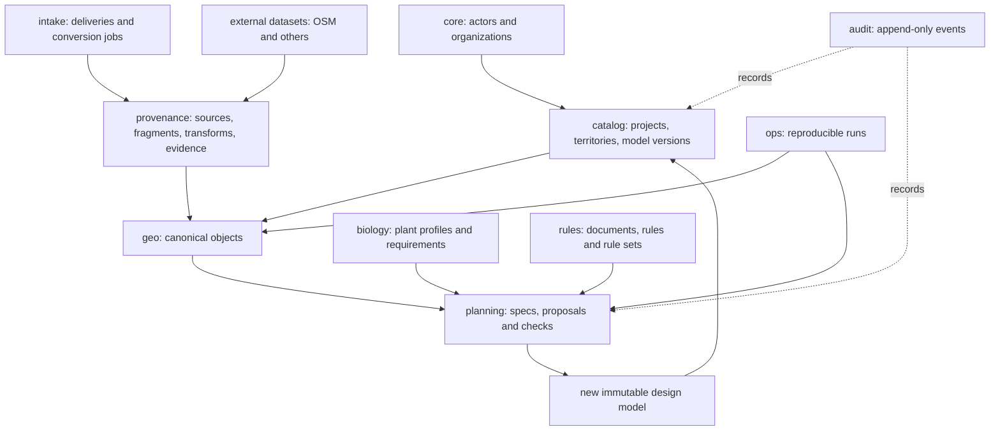

# Схема базы данных GreenPlan v1

Статус: проект физической модели PostgreSQL/PostGIS. Этот документ уточняет предметную модель из [10-domain-data-model.md](10-domain-data-model.md) до границ схем, таблиц, ключей и жизненных циклов. Он ещё не является применённой миграцией.

## 1. Что является центром базы

Центр GreenPlan — не файл и не задание конвертации, а версионированное представление территории:

```text
workspace
  └─ project
      └─ project_revision           что было получено/поставлено
          └─ canonical_model        как поставка интерпретирована
              ├─ spatial_objects    реальные и проектные сущности
              ├─ object_geometries
              └─ object_relations

canonical_model + rule_set + planning_spec
  └─ plan_revision                 воспроизводимый расчёт
      ├─ proposals
      ├─ decision_checks
      └─ accepted design model     новая проектная версия территории
```

Файлы, архивы, CAD handles, OSM ids и логи конвертеров находятся снизу — в `intake` и `provenance`. Они доказывают происхождение фактов, но не задают структуру территории.



## 2. Базовые решения

1. **Неизменяемые опубликованные версии.** `project_revision`, `canonical_model`, `rule_set` и опубликованный `plan_revision` не редактируются. Исправление создаёт следующую версию.
2. **Baseline и design разделены.** Принятая посадка не меняет исходную сцену. Она публикуется в новой design-модели, ссылающейся на baseline.
3. **Объект отделён от доказательства.** `structure.building` имеет внутренний UUID; CAD entity, строка ведомости и OSM way лишь подтверждают его.
4. **Неизвестность является данными.** `NULL + status + evidence` предпочтительнее выдуманного среднего значения.
5. **Расчёты воспроизводимы.** Каждый результат ссылается на входную модель, набор правил, версии алгоритмов, конфигурацию и deterministic seed.
6. **LLM не пишет утверждённые факты напрямую.** Его вывод хранится как candidate evidence/interpretation и проходит review.
7. **Удаление ограничено.** Доменные снимки, правила и аудит не удаляются каскадно из-за удаления файла или job. Для них используются `retired`, `superseded`, `unavailable`.

## 3. Схемы PostgreSQL

| Schema | Назначение | Основные владельцы записи |
|---|---|---|
| `core` | организации, люди/сервисы и принадлежность | auth/admin |
| `catalog` | workspace, проекты, поставки, территории, координатные пространства и модели | project service |
| `geo` | канонические пространственные объекты и предметные расширения | model assembler |
| `biology` | растения, стадии роста и требования к месту | botanical catalog |
| `rules` | нормативные документы, положения, правила и опубликованные rule sets | rulebook service/reviewer |
| `planning` | сценарии, ограничения, кандидаты, решения и подготовка места | planning engine |
| `provenance` | источники, фрагменты, внешние datasets, трансформации и evidence | importers/reviewers |
| `intake` | приём файлов, архивы, CAD-конвертация и диагностика | conversion workers |
| `ops` | универсальные воспроизводимые processing runs и версии ПО | workers |
| `audit` | неизменяемый журнал значимых действий | все сервисы append-only |

Опциональная схема `presentation` для камер, 3D-сцен и render requests проектируется позже. Она читает доменную модель и не должна становиться источником инженерных фактов.

## 4. Идентичность, версии и время

Все доменные PK — UUID. Внешние номера (`OSM way 123`, CAD handle `4A2`, обозначение дерева в ведомости) хранятся как внешние идентификаторы provenance.

Есть три разных времени, их нельзя смешивать:

- `recorded_at` — когда запись появилась в GreenPlan;
- `observed_at`/`snapshot_at` — к какому моменту относится источник;
- `valid_during` — когда объект, документ или правило действует в предметном мире.

В v1 используется **snapshot versioning**: опубликованная canonical model содержит полный согласованный набор объектов. Это сознательно проще bitemporal/event-sourcing и приемлемо для 20 пилотных территорий. Между объектами соседних снимков хранится `supersedes_object_id`.

## 5. `core`: субъекты и ответственность

### `core.organizations`

Заказчик, подрядчик, эксплуатирующая организация, поставщик данных или разработчик системы.

Ключевые поля: `id`, `code`, `name`, `organization_kind`, `status`, `created_at`.

### `core.actors`

Человек или сервисный субъект, на которого можно сослаться из review/audit.

Ключевые поля: `id`, `kind` (`human/service`), `external_subject`, `display_name`, `status`. Пароли и токены в предметной БД не хранятся.

### `core.organization_memberships`

Связь actor с organization и ролью. Доступ к workspace позднее задаётся отдельной membership/RBAC-политикой, а не массивом ролей в `actors`.

## 6. `catalog`: верхний уровень

### Основные таблицы

| Таблица | Назначение | Важные ключи |
|---|---|---|
| `catalog.workspaces` | контракт/конкурс/портфель | `id`, unique `code` |
| `catalog.projects` | административная единица работы, а не папка | `workspace_id`, unique `(workspace_id, code)` |
| `catalog.project_revisions` | неизменяемая входная поставка | unique `(project_id, revision_no)`, `supersedes_id` |
| `catalog.territories` | устойчивая идентичность улицы/участка | unique `code`, без обязательной геометрии |
| `catalog.project_territories` | область проекта в конкретной роли | unique `(project_id, territory_id, role)` |
| `catalog.coordinate_spaces` | CRS/локальная система и единицы | `kind`, `srid`, WKT, status, evidence |
| `catalog.canonical_models` | неизменяемый снимок территории | revision, territory, coordinate space, parent model |
| `catalog.model_dependencies` | какие модели/снимки были использованы при сборке | `(model_id, dependency_model_id, role)` |

`project_revision.content_fingerprint` вычисляется из отсортированного набора source asset hashes и метаданных поставки, а не из пути директории.

### Состояния canonical model

```text
assembling -> needs_review -> approved -> retired
                 └────────> blocked
```

Только `approved` модель допускается как автоматический baseline опубликованного плана. `needs_review` разрешена для диагностики и интерактивного просмотра.

### Координатные пространства

`catalog.coordinate_spaces` содержит:

```text
id, code, kind
srid null
linear_unit
axis_definition
wkt null
parent_space_id null
transform_to_parent_id null
status: asserted/candidate/verified/rejected
evidence_id
```

У canonical model ровно одно working coordinate space. Геометрии разных models нельзя сравнивать без зарегистрированной и подходящей по точности трансформации.

## 7. `geo`: каноническая территория

### `geo.object_classes`

Иерархия на `ltree`: `structure.building`, `utility.water.pipeline`, `vegetation.existing.tree` и т. п. Справочник содержит не данные проекта, а допустимый словарь системы.

Ключи: `id`, unique `code`, unique `path`, `parent_id`, `geometry_policy`, `is_constraint_source`, `attribute_schema`, `active`.

### `geo.spatial_objects`

Одна сущность в одном снимке модели:

```text
id uuid PK
model_id FK -> catalog.canonical_models
class_id FK -> geo.object_classes
stable_key text null
name text null
lifecycle: existing/proposed/to_remove/to_relocate/historical/unknown
semantic_status: inferred/confirmed/needs_review/rejected
confidence numeric(4,3)
valid_during tstzrange null
supersedes_object_id null
properties jsonb
created_by_run_id null
```

`stable_key` нужен для устойчивых обозначений внутри модели, но не является глобальной идентичностью. Уникальность: `(model_id, stable_key)` только для `stable_key IS NOT NULL`.

### `geo.object_geometries`

```text
id uuid PK
object_id FK
role: position/centerline/footprint/crown/root_zone/explicit_protection_zone/...
geom geometry(Geometry)
accuracy_m numeric null
z_policy: absent/absolute/relative/unknown
is_primary boolean
validity_status: valid/repaired/invalid/needs_review
derivation_method text
```

Ограничения:

- не более одной primary geometry на `(object_id, role)`;
- пустая геометрия запрещена;
- SRID/единицы должны соответствовать coordinate space модели;
- `accuracy_m >= 0`;
- GiST по `geom`, B-tree по `(object_id, role)`.

### `geo.object_relations`

Хранятся только предметные или подтверждённые отношения: `part_of`, `belongs_to_network`, `connects_to`, `same_as`, `derived_from`. Все возможные `intersects` и расстояния не материализуются.

Ключи: subject, predicate, object, status, confidence, evidence/derivation run. Для симметричных отношений сервис нормализует порядок UUID.

### Типизированные расширения

- `geo.network_systems` — логическая сеть и владелец;
- `geo.network_components` — 1:1 к spatial object, тип, medium, placement, диаметр, давление, напряжение, глубина;
- `geo.vegetation_objects` — 1:1, life form, taxon/profile, количество и наблюдённые габариты;
- `geo.buildings` — 1:1, назначение, конструктивный тип и только подтверждённые параметры высоты/этажности; existing/proposed уже задаёт общий `lifecycle` объекта;
- `geo.terrain_surfaces` — поверхность и вертикальный datum;
- `geo.soil_units` и `geo.soil_horizons` — 2.5D грунтовая модель;
- `geo.underground_obstacles` — фундаменты, плиты и прочие препятствия;
- `geo.groundwater_observations` — измерение, дата, глубина и evidence.

Колонки, по которым выполняются правила и массовые фильтры, типизированы. Редкие атрибуты могут жить в `properties`, но JSONB не заменяет предметную схему.

## 8. `provenance` и `intake`: доказательства, а не территория

### Граница ответственности

`intake` отвечает: «что получили и как обработали?»

`provenance` отвечает: «какое утверждение из чего выведено?»

`geo` отвечает: «что мы считаем существующим в этой версии территории?»

### `provenance.source_assets`

Логический источник-артефакт: оригинальный DWG, PDF, таблица, книга, выгруженный PBF или документ. Хранит hash, media type, размер, locator хранилища, доступность, лицензию и связь с project revision. Путь не уникален глобально и не является идентификатором.

### `provenance.source_fragments`

Адресуемая часть source asset: CAD handle/layer/block path, PDF page+bbox, spreadsheet range, paragraph locator, image region. Unique `(source_asset_id, fragment_kind, locator_hash)`.

### Внешние данные

- `provenance.external_datasets` — неизменяемый OSM/иной snapshot, URL, license, coverage, SHA-256 и importer config;
- `provenance.external_features` — provider type/id/version, tags и исходная geometry;
- `provenance.source_assets.external_dataset_id` связывает snapshot с общим механизмом evidence.

### `provenance.transforms`

Версионированное преобразование между coordinate spaces: метод, матрица/параметры, контрольные точки, RMS/max error, применимость и reviewer.

Контрольные точки выделяются в `provenance.transform_control_points`, чтобы их можно было проверять запросами, а не извлекать из JSON.

### `provenance.object_evidence`

Связь canonical object с source fragment/external feature:

```text
object_id
source_fragment_id null
external_feature_id null
evidence_role: existence/classification/geometry/attribute/contradiction
attribute_name null
asserted_value jsonb null
transform_id null
method
confidence
decision: candidate/accepted/conflict/rejected/stale
reviewed_by/at
```

CHECK требует ровно один источник: fragment или external feature. Для geometry evidence обязательно задан transform либо source и model уже находятся в одном coordinate space.

### `intake`

Существующие operational-таблицы переезжают сюда почти без смыслового изменения:

- `intake.deliveries` и `intake.delivery_entries` — поставка и дерево файлов/архивов;
- `intake.conversion_jobs`, `conversion_stages`, `conversion_artifacts`;
- `intake.publications`;
- `intake.cad_documents`, `cad_xrefs`, `cad_layers`, `cad_entities` — результаты структурного разбора после конвертации.

`cad_entities` не обязана хранить полную геометрию DXF вечно. Она хранит locator, тип, bbox/простую диагностическую геометрию и ссылку на source fragment. Нормализованная принятая геометрия находится в `geo`.

## 9. `biology`: что требуется растению

### Основные таблицы

| Таблица | Смысл |
|---|---|
| `biology.taxa` | таксон/cultivar и названия |
| `biology.plant_profiles` | расчётный тип посадки и горизонт проекта |
| `biology.growth_stages` | `at_planting`, `design_horizon`, `mature` |
| `biology.profile_dimensions` | диапазоны высоты, кроны и корневой зоны по стадиям |
| `biology.requirement_definitions` | справочник измеримых требований и единиц |
| `biology.plant_requirements` | диапазон/оператор требования конкретного profile+stage |
| `biology.profile_evidence` | источник каждого биологического утверждения |

Размер кроны и глубина корней являются диапазонами с confidence и provenance. Они не хранятся одним числом непосредственно в taxon.

## 10. `rules`: нормативы и применимость

### Источники

- `rules.jurisdictions`;
- `rules.regulatory_documents`;
- `rules.document_editions` с датами действия и source asset;
- `rules.provisions` с точным locator и проверенной выдержкой.

### Исполняемые правила

- `rules.intervention_classes` — `planting.tree`, `planting.shrub`, `soil.excavation`;
- `rules.rules` — effect, geometry operator, distance/value, condition DSL, provision и статус review;
- `rules.rule_subject_classes` — к каким воздействиям применяется;
- `rules.rule_object_classes` — к каким object classes применяется;
- `rules.rule_sets` и `rules.rule_set_members` — неизменяемая опубликованная комплектация.

У approved rule обязательны provision, reviewer, время утверждения и машинно-валидная применимость. `conditions` — ограниченный JSON DSL; SQL, Python и свободный текст LLM не исполняются.

`rule_set_members` фиксирует точный rule id, поэтому последующее исправление создаёт новое rule и новый rule set, а старый расчёт остаётся воспроизводимым.

## 11. `planning`: задача, расчёт и проектное решение

### Постановка задачи

`planning.plans` — устойчивая задача на территории.

`planning.plan_specs` — неизменяемая версия требований: baseline model, rule set, разрешённые plant profiles, цели, веса, бюджет, seed и ограничения заказчика.

### Вычисление ограничений

`planning.constraint_zones` хранит материализованный результат `rule × source object × intervention class/profile × model`. В записи есть обязательный `intervention_class_id` и опциональный `plant_profile_id`; каждая зона ссылается на `ops.processing_runs`.

Явно нарисованная охранная зона остаётся `geo.spatial_object`; вычисленная зона — `planning.constraint_zone`. Они не склеиваются без trace.

### Оценка места

- `planning.candidate_sites` — дискретная точка/область, рассмотренная алгоритмом;
- `planning.site_capacity_assessments` — crown/root/open-soil/groundwater capacity для profile и stage;
- `planning.capacity_checks` — отдельные проверяемые показатели со значением, единицей и result.

### Версия плана

| Таблица | Содержание |
|---|---|
| `planning.plan_revisions` | один результат алгоритма/review для `plan_spec_id` |
| `planning.proposals` | дерево, группа кустарников, покрытие или подготовительное действие |
| `planning.proposal_geometries` | position/footprint/crown/root envelope |
| `planning.decision_checks` | одна нормативная/биологическая/конструктивная проверка |
| `planning.rejections` | рассмотренный, но отвергнутый кандидат и причины |
| `planning.intervention_packages` | посадка вместе с подготовкой места |
| `planning.site_preparation_actions` | excavation/fill/soil replacement/drainage/etc. |

Статусы proposal:

```text
generated -> checked -> needs_review -> accepted -> published
                 ├────> rejected
                 └────> blocked
```

`accepted` ещё не меняет baseline. Публикация создаёт новую canonical design model и связывает её с `plan_revision` через `catalog.canonical_models.created_by_run_id` и provenance relations.

### Проверка решения

`planning.decision_checks` содержит:

```text
proposal_id
check_kind: regulatory/biological/spatial/construction/input_quality
result: pass/fail/unknown/not_applicable
rule_id null
source_object_id null
constraint_zone_id null
requirement_id null
actual_value/required_value/unit
actual_distance_m/required_distance_m
details jsonb
processing_run_id
```

Proposal не получает `accepted`, если существует `fail` или safety-critical `unknown`.

## 12. `ops` и `audit`

### `ops.software_components`

Версии ODA, LibreDWG, parser, mapper, rule engine, optimizer и importer. Фиксируются name, version, container digest/commit и configuration schema version.

### `ops.processing_runs`

Общий envelope воспроизводимой операции: `run_kind`, input fingerprint, config, seed, started/finished, state, component versions, parent run. Он не заменяет специализированные conversion jobs или plan revisions, а связывает их в один audit trace.

### `ops.run_inputs` и `ops.run_outputs`

Явные ссылки на model, rule set, source asset, plan spec и созданный объект/артефакт. В первой миграции допустимы раздельные nullable FK-колонки с CHECK «ровно одна заполнена»; не используется универсальная пара `entity_type + entity_id` без FK.

### `audit.events`

Append-only:

```text
id bigint identity
occurred_at
actor_id
action
entity_schema/entity_table/entity_id
run_id null
before_digest null
after_digest null
metadata jsonb
```

Audit event не является механизмом восстановления всей БД; это журнал ответственности и переходов состояния.

## 13. Ссылочная целостность и удаление

| Родитель | Поведение дочерних записей |
|---|---|
| draft canonical model | `RESTRICT`; отдельная сервисная purge-команда может удалить весь неопубликованный граф |
| approved model | удаление запрещено |
| spatial object внутри draft model | `CASCADE` геометрий/typed extension до публикации |
| source asset | `RESTRICT`; вместо удаления `availability_status=unavailable` |
| external dataset | `RESTRICT`, если есть evidence |
| rule/provision/document edition | `RESTRICT`, если участвовал в rule set/check |
| processing run | `RESTRICT`, если создал опубликованный результат |
| conversion stage/artifact | `CASCADE` только вместе с неопубликованным conversion job |

Такие ограничения частично требуют trigger/policy: обычный FK не знает, опубликован ли model. Все административные purge-операции протоколируются.

## 14. Индексы и партиционирование

Обязательные индексы v1:

- GiST на всех активно запрашиваемых geometry;
- GiST на `valid_during` при появлении temporal queries;
- `geo.spatial_objects(model_id, class_id, lifecycle)`;
- partial unique на primary object geometry;
- `provenance.object_evidence(object_id, evidence_role)`;
- `planning.constraint_zones(model_id, intervention_class_id, plant_profile_id, effect_type)` + GiST geometry;
- `planning.decision_checks(proposal_id, result)`;
- GIN на JSONB только после появления конкретного запроса, а не на каждом `properties`;
- hash/BTREE unique для content fingerprints и SHA-256.

На 20 проектах партиционирование не нужно. Его добавляем по измерению, вероятные кандидаты — `audit.events`, `external_features` и диагностические CAD entities, но не таблицы справочников.

## 15. Представления для API

Сервисы не должны повторять опасные join-цепочки. Планируются стабильные views:

- `api.current_project_models` — последняя approved model проекта, но расчёт всегда сохраняет конкретный model id;
- `api.model_objects` — object + class path + primary geometries;
- `api.object_provenance` — объект и все подтверждающие/конфликтующие источники;
- `api.effective_rules` — правила опубликованного rule set;
- `api.plan_explanations` — proposal и все decision checks с provisions;
- `api.input_quality_issues` — неизвестные CRS, XREF, классы и конфликтующая геометрия.

`current_*` views удобны для UI, но запрещены внутри воспроизводимого расчёта: движок получает явные UUID версий.

## 16. Переход от существующей БД конвертера

Сейчас таблицы `projects`, `source_assets`, `conversion_jobs`, `conversion_stages`, `conversion_artifacts`, `published_artifacts` находятся в `public`, а образ PostgreSQL не содержит PostGIS.

Безопасный порядок:

1. сделать логический backup существующей БД и проверить восстановление;
2. закрепить PostGIS-образ PostgreSQL той же major-версии;
3. подключить миграционный инструмент и таблицу schema version;
4. создать расширения и новые schemas без изменения `public`;
5. создать domain tables и выполнить smoke queries;
6. перенести operational tables в `intake` либо временно дать compatibility views;
7. разделить старый `projects`: файловая регистрация становится delivery/project mapping, предметный проект — `catalog.projects`;
8. связать существующие source assets с project revisions, не меняя hashes и job ids;
9. только после сверки counts/hashes переключить приложение;
10. удалить compatibility objects отдельной поздней миграцией.

Переключение Docker image и перенос таблиц не объединяются в одну необратимую операцию.

## 17. Первая миграционная серия

Предлагаемая нарезка:

```text
0001_extensions_and_schemas
0002_core_catalog
0003_geo
0004_provenance
0005_biology
0006_rules
0007_ops_audit
0008_planning
0009_intake_compatibility
0010_seed_object_and_intervention_classes
0011_integrity_triggers_and_api_views
```

Каждая миграция имеет upgrade, автоматическую проверку контрактов и отдельно документированную стратегию rollback. Для миграций с данными rollback обычно означает восстановление backup/forward fix, а не притворный destructive downgrade.

## 18. Acceptance-запросы схемы

Схема считается пригодной, если без разбора файловых путей можно ответить SQL-запросами:

1. какая approved model использована для данного plan revision;
2. какие существующие сети и здания ограничили конкретную посадку;
3. какая редакция нормы и provision обосновывает каждый отступ;
4. какие требования растения не выполнены и можно ли исправить почву;
5. из каких CAD entities/PDF-фрагментов/OSM features собран объект;
6. какой transform применён и какова его ошибка;
7. какие объекты имеют конфликтующие источники или неизвестный класс;
8. какой software/config/seed воспроизводит результат;
9. что изменилось между двумя canonical models;
10. какие предложения после review опубликованы в design model.

Если на вопрос приходится отвечать разбором имени папки, stderr worker или свободного текста LLM, нужной сущности в схеме ещё нет.

## 19a. Расширение 005: OSM-review и нормативный ingestion

Физическая миграция `platform/db/postgis-init/005_osm_review_and_rule_ingestion.sql` добавляет два staging-контура:

- `provenance.object_candidates` — отобранные кликом OSM features до включения в canonical model;
- `rules.document_ingestion_runs`, `rules.document_segments`, `rules.rule_candidates` — воспроизводимое извлечение документов и неисполняемые кандидаты правил.

`provenance.source_assets.scope_kind=global` позволяет хранить нормативный источник без фиктивной project revision. Исполнимыми остаются только записи `rules.rules`, прошедшие review и включённые в опубликованный rule set. Подробности: [OSM-review](14-osm-building-review.md) и [корпус нормативов](15-regulatory-corpus-and-rule-ingestion.md).

## 19. Решения, которые нужно утвердить перед DDL

1. Проект — всегда одна улица или в будущем один заказ может содержать несколько независимых территорий? Текущая модель поддерживает оба варианта.
2. Храним ли все canonical snapshots полностью или после пилота понадобится structural sharing? Для v1 выбран полный снимок.
3. Какая роль имеет право утверждать CRS, object classification, rule и proposal?
4. Какие пять–десять object classes обязательны для первого end-to-end расчёта?
5. Какие биологические показатели обязательны для дерева v1, а какие дают `unknown`, но не блокируют?
6. Принятый plan создаёт только design model или также CAD export revision как отдельный published artifact?
7. Сколько времени хранятся тяжёлые conversion artifacts и raw external datasets?

До этих ответов можно создавать базовые таблицы и ключи, но нельзя окончательно фиксировать workflow permissions и все CHECK-справочники.
