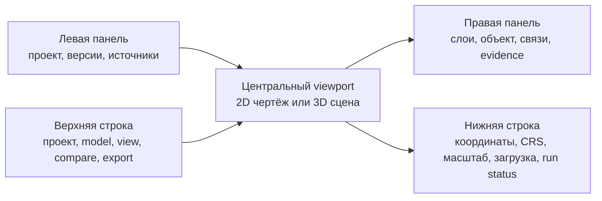
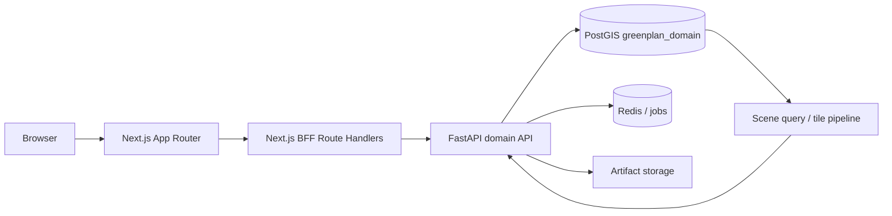

# Задание на проектирование веб-приложения GreenPlan

Статус: продуктовый и технический brief для UX/UI-проектирования и последующей реализации. Первая версия — desktop-first инженерное приложение, а не публичный сайт.

## 1. Цель продукта

Дать архитектору, специалисту по озеленению и оператору данных единое рабочее пространство, в котором можно:

1. открыть конкретный проект, поставку и каноническую модель территории;
2. понять состав исходных материалов и зависимости между ними;
3. увидеть нормализованные объекты, слои, сети, здания и растительность;
4. выбрать объект на чертеже и проследить его до CAD entity, PDF-фрагмента, ведомости или OSM feature;
5. увидеть неопределённости, конфликты и результаты автоматических проверок;
6. переключиться между точным 2D-планом и 3D-представлением, сохранив выбранный объект и видимость слоёв;
7. позднее — запускать генерацию посадок, проверять предложения, публиковать проектную модель и делать снимки камеры.

Главный продуктовый результат: пользователь понимает не только **что нарисовано**, но и **что это означает, откуда взялось и насколько этому можно доверять**.

## 2. Пользователи

### Архитектор / дендролог

Изучает существующее состояние, ограничения и проектные предложения. Ожидает привычную логику CAD/GIS: слои, выделение, свойства, измерения, fit-to-selection, 2D/3D.

### Оператор данных

Разбирает поставку, XREF, листы, неизвестные слои и конфликты источников. Подтверждает сопоставления и трансформации.

### Нормоконтролёр / reviewer

Проверяет классификацию объекта, применённые правила, точность геометрии и причины допуска/отклонения посадки.

### Руководитель / демонстрационный пользователь

Просматривает готовое состояние и сравнение вариантов без возможности менять подтверждённые данные.

## 3. Принцип трёх иерархий

Интерфейс обязан различать три дерева. Их нельзя объединять в одно универсальное дерево:

| Иерархия | Отвечает на вопрос | Примеры |
|---|---|---|
| Поставка и источники | Что нам передали и как файлы связаны? | папка, архив, DWG, XREF, PDF, OSM snapshot |
| Каноническая модель | Какие реальные/проектные сущности мы распознали? | здание, сеть, участок трубы, дерево, грунтовый участок |
| Сцена и слои | Что и как сейчас отображается? | здания, водопровод, подписи, зоны запрета, предложения |

Связь двусторонняя:

- выбор файла подсвечивает объекты, которые из него получены;
- выбор объекта показывает все подтверждающие и конфликтующие источники;
- выключение графического слоя не удаляет объект и не меняет evidence;
- группировка объектов для отображения не становится предметной классификацией.

## 4. Информационная архитектура

### Маршруты верхнего уровня

```text
/workspaces
/workspaces/{workspaceId}/projects
/projects/{projectId}/overview
/projects/{projectId}/workspace?revision=&model=&object=&view=
/projects/{projectId}/reviews
/projects/{projectId}/plans/{planId}
/rules
/plant-catalog
/operations
```

Основной рабочий маршрут — `/projects/{projectId}/workspace`. Выбранные revision, model, object, режим 2D/3D и активная правая вкладка отражаются в URL, чтобы состояние можно было открыть по ссылке.

### Стартовый экран проекта

Показывает:

- название и территорию;
- текущую project revision и approved canonical model;
- статус CRS, полноты зависимостей и семантического покрытия;
- количество источников, объектов, конфликтов и review-задач;
- последние processing runs;
- действия «Открыть рабочее пространство», «Сравнить версии», «Продолжить разбор».

## 5. Главное рабочее пространство



Панели изменяют ширину и сворачиваются. Центральный viewport всегда получает оставшееся пространство и не прокручивается вместе со страницей.

### Верхняя строка

- breadcrumbs workspace → project → revision/model;
- переключатель `2D / 3D`;
- переключатель основы `CAD / OSM / Overlay / Compare`;
- режим `Existing / Design / Combined`;
- сравнение двух model/plan revisions;
- глобальный поиск объекта, слоя, файла или идентификатора;
- индикатор фоновых операций;
- экспорт/снимок и профиль пользователя.

Смена model является заметным действием: пользователь видит версию и статус, а не безымянное «последнее состояние».

### Левая панель: навигация

Вкладки:

1. **Проект** — территория, revisions, canonical models, планы и runs;
2. **Источники** — дерево delivery, архивов, файлов, XREF и внешних datasets;
3. **Проверка** — очередь конфликтов, неизвестных объектов, отсутствующих XREF и неподтверждённых CRS.

Требования к дереву источников:

- virtualized rendering для больших комплектов;
- поиск и фильтр по типу/status/role;
- badges `missing`, `partial`, `converted`, `conflict`;
- раскрытие без загрузки всего дерева;
- действие «показать связанные объекты»;
- исходный путь показывается как атрибут, но не служит названием предметного проекта.

### Центральное поле: 2D

Назначение — точная навигация по чертежу и пространственным объектам.

Обязательные возможности MVP:

- pan, zoom, zoom-to-extent, zoom-to-selection;
- выделение кликом и рамкой;
- hover с краткой карточкой;
- измерение расстояния и площади с показом CRS/единиц;
- включение подложки только при доказанной глобальной привязке;
- отображение исходной и канонической геометрии различимыми стилями;
- overlay проблем, охранных/расчётных зон и предложений;
- индикация LOD/упрощённой геометрии;
- сохранение camera/view state на пользователя и URL.

Для CAD local coordinates используется ортографическая XY-камера. Нельзя незаметно показывать локальный чертёж поверх глобальной карты, если transform имеет статус `candidate` или `rejected`.

### Режим OpenStreetMap и наложение карт

OSM — управляемый слой сравнения, а не безымянная картинка на фоне. Пользователь выбирает один из режимов:

- **CAD** — только исходная/каноническая инженерная модель;
- **OSM** — локально подготовленная карта OSM;
- **Overlay** — OSM и проект одновременно, с регулировкой opacity;
- **Compare** — вертикальный swipe или синхронные окна side-by-side;
- **Difference** — диагностическое отображение смещений и конфликтов сопоставленных контуров.

При Overlay/Compare всегда видны:

- имя и дата OSM snapshot;
- статус transform `verified/candidate/rejected`;
- RMS и максимальная ошибка совмещения;
- working CRS;
- атрибуция `© OpenStreetMap contributors` со ссылкой на лицензию;
- предупреждение, если точности недостаточно для инженерных отступов.

Если transform не подтверждён, Overlay по умолчанию заблокирован. Reviewer может открыть диагностический preview с заметной плашкой `Совмещение не подтверждено`; такой вид не используется для измерений и принятия решения.

В режиме Difference показываются векторы смещения, несовпавшие footprints, OSM-only и CAD-only здания. Выбор OSM feature открывает исходные tags, provider id/version и решение conflation. Принятый OSM-контур выбирает каноническое здание, а не создаёт параллельный «визуальный объект».

OSM-building должен быть кликабельным источником кандидата. В карточке выбора доступны `Добавить в рассмотрение`, `Связать с объектом` и `Не относится к проекту`. Добавление создаёт shortlisted candidate, а не объект утверждённой модели. Для него разрешён маркированный what-if preview нормативных зон; effective-ограничения появляются только после review и публикации новой canonical model. Рамка/lasso поддерживают пакетный отбор, но перед принятием показывается сводка совпадений, конфликтов и недоказанных transform. Детальный контракт: [Кликабельные здания OSM](14-osm-building-review.md).

Для офлайн-режима приложение использует наш PBF snapshot, PostGIS staging и собственный tile/feature pipeline. Массовая загрузка или сохранение тайлов с публичных `tile.openstreetmap.org` и `vector.openstreetmap.org` не входит в архитектуру; публичные сервисы могут использоваться только для обычного интерактивного просмотра при соблюдении их актуальной политики.

### Центральное поле: 3D

3D — другой вид той же модели, а не отдельный импорт:

- сохраняются selection, layer visibility, model revision и фильтры;
- footprint здания превращается в объём только с явным источником высоты;
- synthetic/default height визуально и в свойствах помечается как synthetic;
- сети различаются по placement и глубине; неизвестная глубина не рисуется как достоверная;
- OSM buildings могут дополнять окружение, но визуально отличаются от подтверждённых CAD/геодезических объектов;
- растения могут показываться на стадиях `at_planting`, `design_horizon`, `mature`;
- камера поддерживает orbit, walk/fly и сохранённые viewpoints;
- «Сделать снимок» сохраняет camera pose, model id, layer state и render settings до передачи генератору изображений.

Переключение 2D ↔ 3D должно удерживать центр внимания. Если точное преобразование камеры невозможно, система сохраняет selected object и выполняет fit-to-selection.

### Правая панель: контекст и инспектор

Без выбранного объекта первая вкладка — **Слои**. После выбора открывается **Объект**, но пользователь может вернуться к слоям.

Вкладки:

- **Слои** — визуальное дерево, visibility, opacity, порядок и легенда;
- **Объект** — класс, lifecycle, status, confidence, типизированные свойства и geometry roles;
- **Связи** — `part_of`, сеть, connected objects, conflicts, supersedes;
- **Источники** — CAD/PDF/OSM evidence, locator, transform и точность;
- **Проверки** — применённые правила, расстояния, pass/fail/unknown и provisions;
- **История** — соответствующие объекты соседних model revisions и audit events.

Поля с разным происхождением показывают evidence на уровне атрибута. Конфликтующие значения не сводятся в одно число без решения reviewer.

### Нижняя строка состояния

- координата курсора в working CRS;
- CRS и линейная единица;
- масштаб/высота камеры;
- количество загруженных и выбранных объектов;
- индикатор LOD;
- состояние stream/tiles;
- краткий статус активного processing run.

## 6. Состояния интерфейса

Дизайн обязан покрыть не только happy path:

- проект без canonical model;
- model собирается;
- неизвестная CRS;
- отсутствующие XREF;
- пустой слой;
- источник недоступен;
- объект имеет конфликтующие evidence;
- геометрия invalid/repaired;
- слишком большой extent или объём данных;
- FastAPI/тайлы временно недоступны;
- пользователь не имеет права review;
- background run завершился с warnings или failed.

`unknown`, `needs_review`, `conflict` и `failed` имеют разные визуальные состояния. Жёлтый warning не должен выглядеть как красная ошибка, а отсутствие данных — как нулевое значение.

## 7. Основные пользовательские сценарии MVP

### A. Разобрать структуру проекта

1. Открыть проект и project revision.
2. Изучить дерево поставки и missing XREF.
3. Выбрать DWG/DXF/PDF.
4. Показать связанные канонические объекты на плане.
5. Открыть неизвестные слои и review-кандидаты.

### B. Проверить распознанный объект

1. Выбрать сеть/здание на плане или в поиске.
2. Увидеть класс, геометрию, точность и связи.
3. Раскрыть CAD entity/OSM/PDF evidence.
4. Сравнить конфликтующие геометрии.
5. Подтвердить, отклонить либо оставить `needs_review` — только при наличии роли.

### C. Переключить 2D и 3D

1. Выбрать объект в 2D.
2. Перейти в 3D без потери selection и слоёв.
3. Проверить высоту/глубину и происхождение параметра.
4. Сохранить viewpoint или снимок.

### D. Проверить предложение посадки

1. Открыть plan revision поверх baseline model.
2. Выбрать proposal.
3. Увидеть crown/root envelopes и constraint zones.
4. Проверить нормы, biological capacity и site preparation.
5. Принять, отклонить или отправить на доработку.

### E. Проверить извлечённое нормативное правило

1. Открыть `/rules`, выбрать документ, редакцию и ingestion run.
2. В левом дереве перейти к разделу/пункту/таблице; в центре открыть исходную страницу с подсветкой bounding box.
3. Справа сравнить исходный текст, нормализованный фрагмент и структурированный LLM-кандидат.
4. Проверить subject/object classes, оператор, число, единицу, условия, исключения, юрисдикцию и даты действия.
5. Исправить кандидат либо отклонить его с причиной.
6. Принять кандидата в draft rule, выполнить регрессионные cases и только затем включить approved rule в публикуемый rule set.

Экран не допускает approval, если locator отсутствует, источник/редакция не verified, deterministic validation имеет `invalid` или число не прослеживается до конкретной ячейки таблицы. OCR confidence, LLM confidence и юридический review status показываются раздельно.

## 8. Техническая архитектура веб-контура



### Next.js

Ответственность:

- application shell, routing и layouts;
- SSR стартовой карточки проекта и лёгких справочников;
- интерактивный workspace как Client Component;
- BFF Route Handlers для client-side запросов;
- session/auth cookies, CSRF и нормализация ошибок;
- агрегация лёгких карточек под конкретный экран;
- feature flags и права, влияющие на UI.

Server Components получают данные от FastAPI напрямую на серверной стороне, а не через собственный публичный Route Handler: лишний внутренний HTTP-hop не нужен. Интерактивный viewport и панели обращаются к BFF.

### Next.js BFF

BFF не является вторым предметным backend. Он:

- скрывает внутренний адрес FastAPI и service credentials;
- проверяет сессию, workspace membership и допустимый project scope;
- валидирует параметры и ограничивает размер запроса;
- преобразует несколько небольших domain responses в screen DTO;
- проксирует потоковые ответы без разбора и повторной сериализации;
- выдаёт единый формат ошибок и correlation id.

Через BFF нельзя передавать весь проект одним огромным JSON. Для тяжёлой геометрии Route Handler работает как streaming/reverse proxy; позднее допустим отдельный защищённый tile endpoint с короткоживущим token.

### FastAPI

Единственный владелец предметных операций:

- запросы к PostGIS и применение project/model scope;
- scene manifest и пространственные выборки;
- объекты, relations, provenance, review и planning;
- запуск asynchronous jobs;
- авторизация действия на доменном уровне;
- OpenAPI-контракт;
- SSE для статуса задач; WebSocket оставляется для будущей совместной работы, а не требуется MVP.

Next.js не обращается к PostGIS напрямую.

### Downstream viewers и переносимость результата

Browser workspace — основной рабочий интерфейс, но не единственный consumer платформы. FastAPI и exporter публикуют независимые версионированные контракты:

- DXF с неизменёнными исходными слоями и отдельными слоями `GREEN_AI_*` — для CAD;
- bbox-scoped GeoJSON, позднее MVT/binary transport — для web/GIS;
- glTF с mapping canonical object ids — для внешних 3D-viewers, включая возможный Unreal-клиент.

В исходном ТЗ назван `nanoCAD` либо иной просмотрщик под МосТех.ОС/Linux. `FreeCAD` там не указан, но вместе с LibreCAD/QCAD может войти в расширенную compatibility matrix после реального прогона. Для каждой заявленной совместимости фиксируются версия приложения и ОС, hash тестового DXF, предупреждения при открытии, сохранность исходных слоёв и читаемость отдельного слоя результата.

Viewer не обращается к PostGIS напрямую и не становится владельцем предметных изменений. Отредактированный во внешнем CAD файл принимается обратно только как новый source artifact/revision через intake и provenance pipeline.

Отдельное backlog-направление — [тонкий C#/.NET-клиент внутри nanoCAD](16-nanocad-client-concept.md). Он может дать команды, палитру проекта, запуск jobs и синхронизацию `GREEN_AI_*` прямо в CAD, используя тот же FastAPI/OpenAPI. Такой клиент дополняет web workspace и файловый DXF-контракт, но не заменяет их.

## 9. Рендеринг 2D/3D

### Предлагаемый стек

- **2D:** deck.gl с `OrthographicView` для CAD/local XY; при подтверждённой глобальной CRS — geospatial view с MapLibre-подложкой;
- **3D:** Three.js через React Three Fiber;
- **общий scene state:** feature ids, styles, visibility, selection и filters не зависят от renderer;
- **тяжёлые преобразования:** Web Worker, без блокировки React main thread.

Выбор deck.gl для 2D должен быть подтверждён техническим spike на двух пилотах: линии, полилинии, hatch-like polygons, подписи, picking и локальные координаты. Если точность линий/текста или CAD-стили окажутся неудовлетворительными, renderer заменяется за общим scene adapter, не затрагивая панели и API.

### Контракт сцены

Viewport сначала получает `scene-manifest`:

```json
{
  "model_id": "uuid",
  "coordinate_space": {"id": "uuid", "srid": null, "unit": "metre"},
  "extent": [0, 0, 1000, 500],
  "basemaps": [
    {
      "id": "osm-2026-09",
      "kind": "self_hosted_osm",
      "snapshot_at": "2026-09-01T00:00:00Z",
      "transform_status": "verified",
      "rms_error_m": 0.42,
      "attribution": "© OpenStreetMap contributors"
    }
  ],
  "layers": [
    {
      "id": "buildings",
      "title": "Здания",
      "class_filter": "structure.building",
      "geometry_roles": ["footprint"],
      "feature_count": 152,
      "lods": [0, 1, 2]
    }
  ],
  "issues": {"needs_review": 14, "conflict": 3}
}
```

После manifest клиент загружает только видимые слои и текущий bbox. Ответы содержат canonical object id и минимум атрибутов для picking; полная карточка загружается после выбора.

Форматы по этапам:

1. MVP — chunked GeoJSON/JSON для двух пилотов;
2. после измерения — MVT/геометрический binary transport и server-side LOD;
3. тяжёлые meshes/растения — glTF с feature-id mapping.

## 10. API-контракт первого этапа

### Навигация

```text
GET /v1/workspaces
GET /v1/workspaces/{id}/projects
GET /v1/projects/{id}
GET /v1/projects/{id}/revisions
GET /v1/projects/{id}/models
GET /v1/models/{id}/summary
```

### Источники и структура

```text
GET /v1/project-revisions/{id}/source-tree?parent=&cursor=
GET /v1/source-assets/{id}
GET /v1/source-assets/{id}/related-objects
GET /v1/models/{id}/issues
```

### Сцена и объекты

```text
GET /v1/models/{id}/scene-manifest
GET /v1/models/{id}/features?bbox=&layers=&lod=&cursor=
GET /v1/models/{id}/basemaps
GET /v1/models/{id}/alignment
GET /v1/external-datasets/{id}/tiles/{z}/{x}/{y}.mvt
GET /v1/objects/{id}
GET /v1/objects/{id}/relations
GET /v1/objects/{id}/evidence
GET /v1/objects/{id}/history
```

### Планирование

```text
GET /v1/plans/{id}/revisions
GET /v1/plan-revisions/{id}/proposals
GET /v1/proposals/{id}/checks
POST /v1/proposals/{id}/review
```

### Операции

```text
POST /v1/runs
GET  /v1/runs/{id}
GET  /v1/runs/{id}/events
POST /v1/viewpoints
POST /v1/render-requests
```

### Нормативный корпус

```text
GET  /v1/regulatory-documents?status=&jurisdiction=
GET  /v1/document-editions/{editionId}/segments?query=&kind=
GET  /v1/document-segments/{segmentId}/source-view
POST /v1/document-editions/{editionId}/ingestion-runs
GET  /v1/rule-candidates?edition=&review_status=&validation_status=
POST /v1/rule-candidates/{candidateId}/accept
POST /v1/rule-candidates/{candidateId}/reject
POST /v1/rule-sets/{ruleSetId}/publish
```

Acceptance выполняется FastAPI одной транзакцией: создаёт или связывает provision и draft rule, фиксирует reviewer и audit event. Публикация rule set — отдельное действие с повышенными правами.

Все списки имеют cursor pagination. Пространственные endpoints требуют bbox/LOD либо явного малогабаритного scope. DTO содержат `model_id` и не используют неявное «current» для инженерных операций.

## 11. Frontend-состояние

- URL: project, revision, model, selected object, view mode, basemap mode, compare target;
- server state: TanStack Query или эквивалент с ключами, включающими model id;
- transient workspace state: visibility, OSM opacity, compare divider, open tree nodes, hover, measurement;
- persisted preferences: размеры панелей, theme, camera bookmarks;
- renderer state не должен становиться копией доменной БД.

Смена model id инвалидирует object details, features и checks, но может сохранить намерение пользователя: class filters, открытые панели и приблизительный camera extent.

## 12. Визуальный язык

### Арт-дирекшн

Приложение должно выглядеть как флагманский профессиональный инструмент, разработанный сильной продуктовой и motion-командой: современно, уверенно, точно и дорого. Это не означает обилие декоративных эффектов. Премиальность строится на сетке, типографике, пропорциях, качестве состояний, скорости отклика и микровзаимодействиях.

Характер: **precision instrument × contemporary architecture studio**.

- плотное рабочее пространство без визуального шума;
- глубокий graphite/ink canvas, мягкие нейтральные поверхности и один фирменный botanical accent;
- светлая тема проектируется как самостоятельная система, а не инверсия тёмной;
- стекло/blur применяется локально для плавающих controls, но не превращает всё приложение в набор прозрачных карточек;
- тонкие границы, управляемая глубина и мягкие тени вместо тяжёлых рамок;
- крупные радиусы используются только у верхнеуровневых поверхностей, меньшие — у controls;
- визуальная иерархия создаётся размерами, воздухом и контрастом, а не количеством цветов.

Не следует стилизовать приложение как игровой 3D-редактор или типовую админку. Инженерное происхождение и статус данных важнее визуального эффекта, но техническая плотность не оправдывает неряшливость.

### Tailwind CSS и токены

Интерфейс реализуется на Tailwind CSS. Дизайн-система строится поверх semantic CSS variables, а Tailwind utilities ссылаются на токены:

```text
surface.canvas / surface.panel / surface.elevated / surface.floating
text.primary / text.secondary / text.tertiary / text.inverse
border.subtle / border.default / border.strong
accent.primary / accent.hover / accent.muted
state.info / state.success / state.warning / state.danger / state.unknown
geometry.cad / geometry.osm / geometry.canonical / geometry.proposed
```

Запрещается разбрасывать по JSX случайные hex/RGB, arbitrary spacing и несогласованные shadows. Токены охватывают color, spacing, typography, radius, elevation, blur, z-index и motion.

Компонентные primitives можно строить на доступной headless-библиотеке, но внешний вид не должен оставаться default theme. Все primitives оборачиваются в собственный UI-kit GreenPlan.

### Типографика и сетка

- основной шрифт — современный variable grotesk, self-hosted;
- отдельный mono — только handles, ids, координаты, версии и измерения;
- tabular numerals обязательны в размерах, координатах и метриках;
- 4 px base grid, согласованные density presets `comfortable/compact`;
- иерархия заголовков ограничена: экран, секция, label, caption;
- длинные русские названия проверяются на реальных данных, используются middle ellipsis, tooltip и copy action.

Точная гарнитура и финальная палитра выбираются после трёх визуальных направлений; технологический brief не должен подменять арт-дирекшн случайным первым выбором.

### Компоненты

Обязательный набор собственной библиотеки:

- app shell, resizable/collapsible panel и split view;
- command palette и global search;
- project/model switcher;
- segmented control 2D/3D и CAD/OSM/Overlay/Compare;
- virtualized tree row с nesting, badges и progress;
- layer row с visibility, opacity, legend и context menu;
- property grid с attribute-level evidence;
- tabs, tooltip, popover, dropdown, dialog, drawer;
- status badge, confidence meter и issue callout;
- toast и background operation center;
- map controls, scale, coordinate readout и compare slider;
- skeleton, empty, partial, permission и recovery states.

Компоненты имеют hover, focus-visible, pressed, selected, disabled, loading, error и high-density варианты. Иконки берутся из одной профессиональной библиотеки; эмодзи и самодельные псевдоиконки запрещены.

### Motion

Анимация объясняет изменение состояния и поддерживает пространственную непрерывность:

- micro feedback: примерно 120–180 ms;
- панели, popover и переключения режима: примерно 200–280 ms;
- camera transitions и сложная смена сцены: примерно 300–500 ms с возможностью прерывания;
- spring используется для физических перемещений, easing — для opacity/color;
- панели не «прыгают», контент сохраняет фокус при раскрытии;
- 2D→3D показывает непрерывный переход центра/selection, если renderer это позволяет;
- загрузка геометрии не вызывает layout shift;
- `prefers-reduced-motion` отключает необязательное движение и заменяет camera flight на мгновенный переход.

Не анимируются тысячи геометрий через React/CSS при pan/zoom: scene motion остаётся внутри GPU renderer. Motion не должен задерживать частые инженерные операции.

### Состояния и доступность

- цвет класса объекта отделён от цвета состояния;
- `selected`, `hover`, `conflict`, `needs_review`, `proposed`, `rejected` различимы цветом, формой/обводкой и подписью;
- focus ring является частью визуального языка, а не браузерным остатком;
- контраст проверяется для обеих тем и всех status colors;
- опасные действия требуют явного scope и подтверждения;
- attribution OSM остаётся читаемой и никогда не перекрывается панелями или controls.

## 13. Производительность и качество

Целевые требования для прототипа:

- shell и metadata проекта доступны без загрузки геометрии;
- viewport не получает неограниченный набор объектов;
- pan/zoom не блокируют интерфейс обработкой React-компонентов на каждый feature;
- выбор объекта возвращает отклик немедленно для уже загруженного слоя;
- дерево с десятками тысяч source entries виртуализировано;
- запросы отменяются при смене bbox/model;
- stale response от старой model не попадает в новую сцену;
- WebGL context loss и отсутствие GPU дают понятное состояние восстановления;
- клавиатурная навигация доступна для дерева, вкладок и инспектора;
- viewport имеет текстовую альтернативу в виде списка выбранных/видимых объектов.

Конкретные лимиты feature count, latency и FPS фиксируются после замеров на двух пилотах, а не выдумываются заранее.

## 14. Безопасность

- браузер не получает пароль PostGIS или внутренний FastAPI token;
- BFF и FastAPI оба проверяют доступ, но доменное разрешение остаётся в FastAPI;
- каждый mutation содержит ожидаемые revision/model ids и idempotency key;
- published/approved snapshots не редактируются через API;
- загрузки ограничены по размеру/type и направляются в intake, а не в web-process memory;
- внутренние stderr, пути host filesystem и SQL errors не отдаются пользователю;
- review и publish пишутся в `audit.events`.

## 15. Объём первого прототипа

### Входит

- project list и project overview;
- рабочее пространство с тремя панелями;
- source tree и model/layer tree;
- 2D viewport двух пилотных проектов;
- режимы CAD/OSM/Overlay/Compare с локальным OSM snapshot;
- выбор объекта, свойства, relations и evidence;
- переключение 2D/3D с простыми зданиями и растениями;
- issues/review queue в read-only виде;
- read-only корпус нормативов и side-by-side review первых rule candidates;
- deep links и восстановление состояния;
- отображение статуса background runs.

### Не входит

- редактирование произвольной CAD-геометрии;
- полноценная совместная работа нескольких пользователей;
- финальный массовый редактор нормативных правил и автоматическая публикация;
- фотореалистичный material editor;
- автоматическая генерация посадок из UI до стабилизации read-only модели;
- мобильная версия рабочего viewport.

## 16. Этапы проектирования и разработки

### Этап A. UX и технический spike

- прототип главного workspace в трёх состояниях: normal, selected object, data conflict;
- проверка resizable panels, trees и deep-link state;
- spike deck.gl на Песчаном переулке и Куликовской;
- проверка self-hosted OSM tiles, compare slider и отображения alignment error;
- spike shared selection 2D ↔ 3D;
- фиксация scene-manifest и feature endpoint.

### Этап B. Read-only vertical slice

- Next.js shell + BFF;
- FastAPI read API;
- project/revision/model navigation;
- source tree, scene, object inspector, provenance;
- один end-to-end deployment в Docker Compose.

### Этап C. Review

- issues queue;
- candidate/accepted/conflict/rejected transitions;
- сравнение source и canonical geometry;
- audit trail и permission gates.

### Этап D. Planning и визуализация

- constraint layers и proposals;
- decision checks;
- принятие plan revision и публикация design model;
- viewpoints, screenshots и AI-render request.

## 17. Критерии приёмки дизайна

Дизайн можно передавать в реализацию, если:

1. различимы source tree, object hierarchy и display layers;
2. выбранная revision/model всегда видна;
3. selection сохраняется при переключении 2D/3D;
4. за два действия можно перейти от объекта к его evidence;
5. conflict и unknown невозможно принять за подтверждённый факт;
6. длинные русские названия файлов и слоёв проверены на реальных данных;
7. normal/loading/empty/error/partial/permission states нарисованы;
8. viewport остаётся рабочим при открытых обеих панелях на 1440×900;
9. основные операции доступны клавиатурой;
10. макет использует реалистичные данные двух пилотов, а не `Layer 1 / Object 2`;
11. Overlay всегда показывает snapshot, attribution, transform status и accuracy;
12. OSM и CAD можно сравнить opacity/swipe без потери selection;
13. UI-kit имеет обе темы, compact density и полный набор интерактивных состояний;
14. motion-spec включает duration/easing/reduced-motion и не мешает работе viewport;
15. визуальный результат не выглядит как стандартная Tailwind/admin template.

## 18. Решения по умолчанию

- Desktop-first, минимальный рабочий viewport: 1280×720; целевой: 1440×900 и выше.
- Next.js App Router + TypeScript.
- Tailwind CSS + semantic design tokens + собственный GreenPlan UI-kit.
- Browser → Next.js BFF → FastAPI; прямого доступа браузера к PostGIS нет.
- FastAPI — владелец domain API и OpenAPI.
- 2D-кандидат — deck.gl; 3D-кандидат — React Three Fiber.
- OSM overlay работает от собственного snapshot/tile pipeline; публичные OSM tiles не являются offline backend.
- Начальный transport — bbox-scoped chunked GeoJSON; переход на tiles/binary после измерения.
- SSE для прогресса задач; WebSocket не требуется в MVP.
- Первая версия read-only, кроме review transitions и сохранения UI preferences.

## 19. Технические ориентиры

- [Next.js: Backend for Frontend](https://nextjs.org/docs/app/guides/backend-for-frontend)
- [Next.js Route Handlers](https://nextjs.org/docs/app/getting-started/route-handlers)
- [FastAPI StreamingResponse](https://fastapi.tiangolo.com/advanced/custom-response/)
- [FastAPI WebSockets](https://fastapi.tiangolo.com/advanced/websockets/)
- [deck.gl OrthographicView](https://deck.gl/docs/api-reference/core/orthographic-view)
- [deck.gl interactivity and picking](https://deck.gl/docs/developer-guide/interactivity)
- [React Three Fiber](https://r3f.docs.pmnd.rs/getting-started/introduction)
- [OSMF Tile Usage Policy](https://operations.osmfoundation.org/policies/tiles/)
- [OSMF Vector Tile Usage Policy](https://operations.osmfoundation.org/policies/vector/)
- [OpenStreetMap attribution and licence](https://www.openstreetmap.org/copyright?locale=en-GB)
