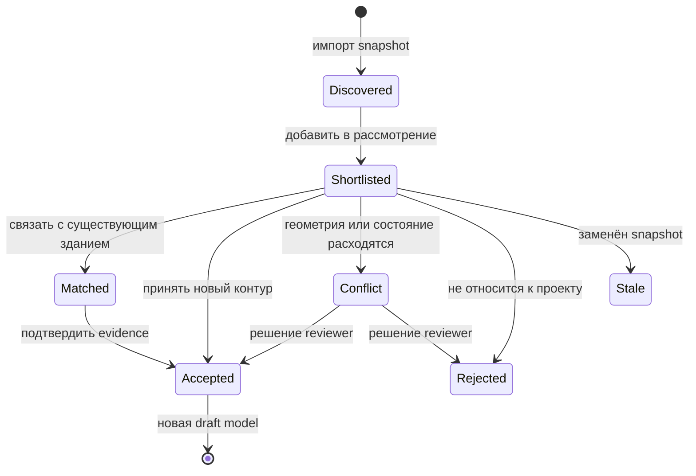

# Кликабельные здания OSM и включение в модель

## Решение

OSM-слой является интерактивным источником кандидатов, а не только подложкой. Пользователь может выбрать здание, изучить происхождение и точность, добавить его в область рассмотрения, сопоставить с существующим объектом и затем принять или отклонить. Клик не должен напрямую менять утверждённую модель.



## Сценарий в интерфейсе

В режимах `OSM`, `Overlay`, `Compare` и `Difference` полигон здания имеет hover и hit-test. Один клик:

1. подсвечивает feature, но не переносит его в проект;
2. открывает справа карточку с `building=*`, адресом, OSM type/id/version, snapshot date, валидностью геометрии и лицензией;
3. показывает transform, RMS/max error, дату проектной модели и возможные CAD-совпадения;
4. предлагает действия `Добавить в рассмотрение`, `Связать с объектом`, `Не относится к проекту`;
5. после добавления показывает запись в очереди проверки и предварительное влияние на допустимую область посадки.

Для нескольких зданий доступны рамка/lasso и пакетное добавление. Пакетное принятие допустимо только после показа сводки: количество совпадений, конфликтов, объектов без доказанной трансформации и ожидаемое изменение площади допустимой посадки.

Состояния отображаются различимо и не только цветом:

| Состояние | Стиль | Что разрешено |
|---|---|---|
| OSM background | тонкий нейтральный контур | просмотр |
| shortlisted | штриховка и badge `На рассмотрении` | preview ограничений |
| matched | двойной контур и ссылка на canonical object | проверка evidence |
| conflict | предупреждающий паттерн | только ручное решение |
| accepted | основной стиль здания с маркером OSM provenance | нормативный расчёт после публикации модели |
| rejected/stale | приглушённый перечёркнутый контур | просмотр истории |

## Что означает «добавить в рассмотрение»

Создаётся `provenance.object_candidates`, связанный с:

- неизменяемым `external_feature` конкретного OSM snapshot;
- текущей собираемой canonical model;
- предполагаемым классом `structure.building`;
- применённым transform;
- proposed geometry в working CRS;
- метриками IoU, смещения границы/центроида и расхождения площади.

Если пользователь работает с approved model, сервер сначала создаёт дочернюю draft model. Утверждённая версия не меняется. При принятии:

- при совпадении добавляется evidence к уже существующему зданию;
- при отсутствии здания создаётся новый `geo.spatial_object` и `structure.building`;
- `canonical_object_id` записывается в кандидата;
- принятие, reviewer, время и комментарий попадают в audit trail.

Повторный выбор того же feature идемпотентен: уникальность `(model_id, external_feature_id, target_class_id)` не даёт создать дубликат.

## Ограничения от зданий

Здание не содержит собственный «универсальный отступ». Его класс, назначение, статус и геометрия являются входом, а расстояние, запрет или требование согласования задаёт опубликованное правило с точной ссылкой на норму.

Есть два режима расчёта:

- `preview` — shortlisted-кандидат формирует визуальный what-if buffer с маркировкой `не для заключения`;
- `effective` — ограничение участвует в решении только для принятого объекта опубликованной canonical model и approved rule set.

Если назначение здания неизвестно, правило требует более узкой классификации или transform не verified, результат имеет состояние `unknown/needs_review`, а не `allowed`. Погрешность исходной геометрии хранится отдельно от нормативного отступа; при консервативном preview они суммируются явно и показываются пользователю раздельно.

## API-контракт

```text
GET  /v1/models/{modelId}/external-features?dataset=&bbox=&kind=building
GET  /v1/external-features/{featureId}
POST /v1/models/{modelId}/object-candidates
GET  /v1/models/{modelId}/object-candidates?status=shortlisted,conflict
POST /v1/object-candidates/{candidateId}/match
POST /v1/object-candidates/{candidateId}/accept
POST /v1/object-candidates/{candidateId}/reject
GET  /v1/object-candidates/{candidateId}/constraint-preview
```

Мутации принимают `Idempotency-Key` и expected model version. Ответ при конфликте версии — `409`, а не молчаливое применение к новой модели. BFF проверяет сессию и права; FastAPI выполняет предметную транзакцию и пишет аудит.

## Критерии приёмки

- OSM-building выбирается кликом и рамкой без выбора скрытого CAD-объекта.
- В карточке всегда видны snapshot, provider id, transform и точность.
- `Добавить в рассмотрение` не меняет approved model.
- Один feature невозможно добавить дважды в одну модель.
- До принятия буферы имеют только preview-status и не дают итогового `allowed`.
- Принятие создаёт/связывает canonical building и сохраняет evidence.
- Замена OSM snapshot помечает необработанные старые кандидаты `stale`, не переписывая историю.
