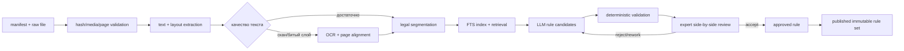

# Корпус нормативов и извлечение исполняемых правил

## 1. Область

В задании обязательным ядром названы:

- СП 42.13330.2016;
- постановление Правительства Москвы от 10.09.2002 № 743-ПП;
- постановление Правительства Москвы от 06.08.2002 № 623-ПП и утверждённые им МГСН 1.02-02.

Локальный файл `dataset/Нормативные акты ссылки.docx` добавляет СП 82.13330.2016, СП 59.13330, Закон Москвы № 18 от 30.04.2014, ГОСТ 21.508-2020 и другие материалы. Они образуют расширенный корпус и не считаются автоматически применимыми только из-за присутствия в списке.

Важно различать документ и редакцию, официальный оригинал и справочную копию, текстовый фрагмент с координатами страницы, предложенную LLM интерпретацию, утверждённое правило и опубликованный rule set конкретного расчёта.

## 2. Получение и хранение

Для каждой редакции ведётся manifest: реквизиты, издатель, юрисдикция, официальный URL, дата проверки, дата получения, применимость, доступность полного текста, SHA-256 и условия хранения. Raw-файл неизменяем; повторная загрузка с другим hash создаёт новую редакцию или требует расследования.

Приоритет источников:

1. официальный портал органа, издавшего акт;
2. официальный портал опубликования правовых актов;
3. официальный каталог стандарта с законно полученной локальной копией;
4. справочная правовая система как средство сверки, но не скрытый источник истины.

Нельзя автоматически скачивать и переиздавать полный текст платного ГОСТ/СП с неофициального зеркала. Если официальный источник даёт лишь карточку, manifest хранит ссылку и метаданные, а `access_policy=link_only`; текст загружается пользователем из законного экземпляра.

### Вечернее бесплатное окно доступа

Если справочная система законно открывает чтение документов после окончания рабочего дня, это окно можно использовать для формирования внутреннего исследовательского корпуса. Это не разрешение обходить paywall, CAPTCHA, ограничения автоматизации или распространять полученные тексты.

Для каждой вечерней сессии оператор фиксирует:

- провайдера, точный URL и показанные условия доступа;
- начало и окончание доступного окна с timezone;
- реквизиты документа, редакцию и список учтённых изменений;
- способ получения: официальный download, print-to-PDF или сохранение разрешённой HTML-страницы;
- исходный media type, размер и SHA-256;
- дату проверки действительности и доступность повторного открытия;
- политику `internal_copy`, `link_only` или `restricted`.

Предпочтителен предоставленный сайтом download. Print-to-PDF применяется только при разрешённом чтении и отсутствии download; в этом случае сохраняются URL страницы, timestamp и скрин/служебная страница с реквизитами редакции. Автоматический загрузчик по умолчанию не авторизуется в справочных системах и не пытается воспроизвести пользовательскую сессию: сначала делаем контролируемый ручной acquisition, затем разбираем уже локальные файлы.

#### КОДЕКС/Техэксперт (`docs.cntd.ru`)

Проверка 2026-09-24 показала:

- `https://docs.cntd.ru/document/5200163` — legacy-карточка СНиП 2.07.01-89, а не идентификатор текущего СП 42;
- актуализированный СП 42 с изменениями № 1–4 адресуется как `https://docs.cntd.ru/document/456054209`;
- разделы имеют устойчивые ссылки вида `/document/456054209/titles/{sectionId}` и подходят для точных citations;
- из agent environment DNS и HTTP доступны, HTTP возвращает штатный redirect на HTTPS, но TCP-соединение с HTTPS истекает по timeout до получения заголовков;
- публичный поисковый индекс видит оглавление и некоторые разделы, но это не надёжный канал полной выгрузки.

Рабочий вариант — ручное сохранение текущей редакции из обычного браузера пользователя в бесплатное вечернее окно. После появления PDF/HTML в `normatives/raw/` автоматическая часть считает hash, проверит комплект изменений, извлечёт структуру и загрузит сегменты в PostGIS. Legacy `5200163` можно хранить только как historical/reference edition и запрещено молча смешивать с `456054209`.

```text
normatives/
  manifest.yml
  raw/                 # неизменяемые разрешённые оригиналы
  extracted/           # машинное извлечение, не первоисточник
  README.md
```

## 3. Конвейер



### Извлечение

- Born-digital PDF: извлекаются текстовые блоки, номер страницы и bounding box.
- Скан: OCR выполняется постранично, исходное изображение сохраняется; низкая уверенность помечается.
- Таблица: сохраняются подпись, заголовки, строки и объединённые ячейки; строка не отрывается от таблицы.
- DOCX/HTML: сохраняется иерархия заголовков, списков, таблиц и сносок.
- Сегментация идёт по структуре права — раздел, пункт, подпункт, таблица, примечание, приложение, — а не по произвольному числу токенов.

Поиск MVP строится на PostgreSQL Full Text Search с русской конфигурацией. Embeddings/pgvector можно добавить для семантического recall, но цитируемый ответ всегда возвращает точный fragment и page locator; векторное сходство не является доказательством.

### Извлечение кандидата LLM

Модель получает только найденные фрагменты и строгую JSON-схему:

```json
{
  "source_fragment_id": "uuid",
  "provision_locator": "пункт/таблица",
  "subjects": ["planting.tree"],
  "objects": ["structure.building.residential"],
  "effect_type": "minimum_clearance",
  "geometry_operator": "buffer_footprint",
  "distance_m": 5.0,
  "comparison_operator": ">=",
  "conditions": {},
  "exceptions": [],
  "confidence": 0.0
}
```

Значение выше — пример формата, не норматив. Модель обязана вернуть `null/needs_review`, если единица, субъект, объект, условие или locator неоднозначны. Prompt hash, модель, версия и raw output сохраняются.

### Детерминированные проверки

До экспертного экрана система проверяет:

- fragment принадлежит заявленной редакции;
- locator существует и соответствует странице;
- число и единица явно присутствуют в источнике;
- размерность переводится в канонические метры без догадки;
- subject/object code существуют в классификаторах;
- условия и исключения не потеряны;
- effective date и юрисдикция совместимы с проектом;
- правило не дублирует и не противоречит опубликованному без явного supersedes;
- таблица прочитана с правильными заголовками строки/столбца.

### Экспертная проверка

Reviewer видит рядом скан/страницу, извлечённый текст и карточку правила. Он может исправить структуру, но не исходную цитату. Принятие создаёт `rules.provisions` и `rules.rules`; кандидат получает ссылку `accepted_rule_id`. Исполняющий движок читает только `rules.rules.status=approved` из `rules.rule_sets.status=published`.

## 4. Версии и изменения

«Действует документ» и «мы проверили эту редакцию» — разные состояния. Для редакции хранятся:

- `effective_during` — юридический период действия;
- `consolidated_through` — по какое изменение собран текст;
- `checked_at` и reviewer — когда это проверила команда;
- `retrieved_at` и hash — какой файл фактически разбирался;
- `access_policy` — можно ли хранить/передавать полный текст.

Новая редакция запускает структурный diff. Затронутые provisions и правила переходят в очередь revalidation; опубликованный старый rule set остаётся воспроизводимым, но UI предупреждает о возможной устарелости.

## 5. База данных

Миграция `005_osm_review_and_rule_ingestion.sql` добавляет:

- global scope для нормативных `provenance.source_assets`;
- метаданные получения и доступа к `rules.document_editions`;
- `rules.document_ingestion_runs`;
- `rules.document_segments` с page/bbox через source fragment и русским FTS;
- `rules.rule_candidates` с результатом валидации, review и ссылкой на принятое правило;
- `provenance.object_candidates` для кликабельного отбора зданий OSM.

## 6. Очереди и компоненты

Нормативный pipeline использует отдельные Celery queues:

```text
document-fetch      # только allowlisted URL и ручные uploads
document-extract    # PDF/DOCX/OCR/layout
document-index      # segmentation + FTS
rule-extract        # LLM candidates
rule-validate       # schema/unit/taxonomy/conflict checks
```

Сетевой fetch изолирован от OCR/LLM workers. Workers не получают произвольный URL из документа; загрузчик использует allowlist, лимиты размера, проверку MIME, checksum и антивирусный gate. Секреты LLM не передаются extractor-контейнеру.

## 7. Definition of Done первой очереди

1. В manifest зарегистрированы обязательные три источника и их проверенные редакции.
2. Для доступных официальных файлов сохранены hash, URL и дата получения.
3. Каждая страница/таблица имеет воспроизводимый locator.
4. Поиск находит фрагмент по объекту, виду посадки и термину ограничения.
5. Не менее десяти кандидатов извлечены, сверены человеком и покрыты регрессионными тестами.
6. Ни один LLM-кандидат не исполняется до approval и публикации rule set.
7. Объяснение посадки открывает точный документ, редакцию, пункт/таблицу и страницу.

## 8. Проверенные официальные точки входа

- [743-ПП, официальный PDF Правительства Москвы](https://www.mos.ru/upload/documents/files/7389/Postanovlenie743-PP.pdf)
- [СП 42.13330.2016, карточка Минстроя России](https://minstroyrf.gov.ru/docs/14465/)
- [СП 82.13330.2016, карточка Минстроя России](https://minstroyrf.gov.ru/docs/14131/)

Ссылки проверены 2026-09-24. Карточка документа не доказывает, что локально собрана последняя консолидированная редакция; изменения регистрируются отдельными источниками и связываются с edition до approval правил.
