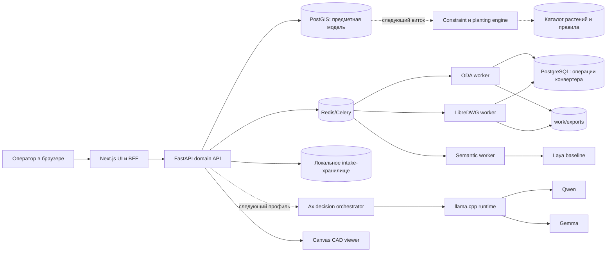
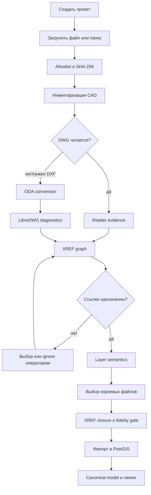

# Устройство GreenPlan: компоненты, конвейер и следующий виток

## 1. Назначение документа

Этот документ даёт единое техническое представление о GreenPlan: от загрузки
неструктурированной папки ландшафтного проекта до будущей генерации посадочных
решений. Он описывает фактическое состояние прототипа и целевое развитие, но не
заменяет ADR, схемы БД и планы фаз.

Обозначения статуса:

- **работает** — реализовано в текущем прототипе и покрыто тестами или ручной
  проверкой;
- **частично** — есть модель данных или отдельный вертикальный срез, но контур не
  завершён;
- **планируется** — целевой контракт, который должен пройти обычный цикл
  ADR → phase plan → tests → implementation → report.

## 2. Задача системы

Проектировщик редко получает один самодостаточный чертёж. Типичная поставка
содержит несколько DWG, печатные листы, XREF, архивные редакции, таблицы учёта
растений и исходные материалы от разных подрядчиков. Названия файлов, слоёв и
листов не образуют общего стандарта, а часть геометрии может находиться во
внешних ссылках.

GreenPlan превращает такую поставку в систему предметных сущностей:

1. фиксирует файлы, их происхождение и структуру каталогов;
2. строит граф CAD-зависимостей;
3. читает или конвертирует чертежи с сохранением доказательств;
4. классифицирует слои и объекты в закрытую предметную таксономию;
5. собирает каноническую пространственную модель территории;
6. применяет проверенные нормативные ограничения;
7. строит и ранжирует предложения по озеленению;
8. позволяет специалисту проверить каждое решение и его обоснование.

Главная граница ответственности: генеративная модель может предложить вариант,
но не может отменить геометрическое или нормативное ограничение. Итоговая
допустимость вычисляется детерминированно и подтверждается человеком.

## 3. Контекст и роли

| Роль | Основная задача |
|---|---|
| Оператор поставки | загрузить материалы, восстановить XREF, убрать мусор и довести импорт до публикации |
| Архитектор/дендролог | классифицировать слои, подтвердить зелёные зоны, подобрать растения и оценить композицию |
| Инженер/нормоконтролёр | проверить сети, охранные зоны, редакции норм и причины допусков/запретов |
| Администратор | развернуть сервисы, хранить данные, модели и резервные копии |
| Разработчик/исследователь | добавлять reader, эвристики, модели и алгоритмы через ADR и проверяемые фазы |

## 4. Компонентная схема



## 5. Исполняемые компоненты

### 5.1 Next.js web

**Статус: работает.**

`apps/web` содержит пользовательский интерфейс и BFF-границу. Браузер не знает
учётных данных БД и не обращается к PostGIS напрямую. Основные пространства:

- каталог проектов;
- создание проекта и загрузка поставки;
- мастер `Материалы → CAD-разбор → Проверка → Публикация`;
- дерево поставки;
- CAD-граф и инспектор выбранного файла;
- таблица слоёв и назначение категорий;
- панель проблем и журнал действий;
- 2D Canvas-просмотр опубликованной модели.

Навигация и выбранный объект должны воспроизводиться из URL. Для больших моделей
применяются пространственная выборка, overscan, кэш геометрии и отложенная точная
перерисовка. Эти решения зафиксированы в ADR-0009–ADR-0016.

### 5.2 FastAPI

**Статус: работает, отдельные длинные операции требуют выноса в фон.**

`apps/api` владеет предметными контрактами:

- проекты и intake-редакции;
- загрузка и удаление файлов из состава проекта;
- анализ поставки;
- предложения классификации и решения оператора;
- XREF и findings;
- выбор корней публикации;
- импорт канонической модели;
- запросы объектов и геометрии для viewer.

FastAPI не должен становиться CAD-конвертером или LLM-runtime. Он координирует
специализированные сервисы и сохраняет состояние процесса. Текущая публикация
может быть длительной; ADR-0043 предусматривает серверную single-flight задачу,
персистентный прогресс и безопасный retry.

### 5.3 Операционный PostgreSQL

**Статус: работает.**

Контейнер `postgres` хранит очередь и аудит конверсионной платформы: входной путь,
SHA-256, стадии ODA/LibreDWG, коды завершения, предупреждения и сведения об
артефактах. Сами тяжёлые DWG/DXF/JSON не кладутся в строки БД.

### 5.4 Предметный PostGIS

**Статус: работает для intake, CAD-публикации и базового нормативного каркаса.**

Контейнер `postgis` хранит:

- проекты, редакции и территории;
- поставки, assets, CAD-документы, слои, XREF и findings;
- решения классификации и evidence;
- канонические пространственные объекты и геометрии;
- render assemblies и вычисленный основной пространственный кластер;
- нормативные документы, положения, правила и версии наборов правил;
- будущие ограничения, посадочные места и варианты растений.

Физическая схема разделена на `catalog`, `geo`, `biology`, `rules`, `planning`,
`provenance`, `intake`, `ops`, `audit` и `api`. Подробности приведены в
[предметной модели](../10-domain-data-model.md) и [физической схеме](../12-database-schema-v1.md).

### 5.5 Redis и Celery

**Статус: работает для конвертации и семантических подсказок.**

Redis является брокером, а не долговременным источником истины. Celery разделяет
очереди ODA, LibreDWG и semantic jobs. Результаты и переходы состояний должны
фиксироваться в PostgreSQL/PostGIS, чтобы перезапуск контейнера не стирал историю.

### 5.6 ODA worker

**Статус: работает как основной издатель DXF.**

ODA File Converter запускается внутри контейнера под `xvfb`, но сам proprietary
runtime монтируется с host read-only. Он не входит в Git и не должен попадать в
публичный образ без отдельной проверки лицензии.

Задача worker:

1. получить неизменяемую копию DWG;
2. вызвать ODA с зафиксированным форматом назначения;
3. сохранить stdout/stderr, код возврата и метаданные результата;
4. вычислить SHA-256 DXF;
5. передать результат следующей стадии, не объявляя его автоматически полным.

### 5.7 LibreDWG worker

**Статус: работает как независимый диагностический reader.**

LibreDWG не подменяет ODA. Он пытается прочитать DWG независимо и сообщает о
неподдержанных классах, proxy-объектах и ошибках разбора. Различие результатов
двух движков становится evidence для fidelity gate.

### 5.8 DXF reader и XREF assembly

**Статус: работает.**

Python-контур на `ezdxf` инвентаризирует layout, layer, block и entity types,
извлекает XREF, применяет сохранённые решения оператора и собирает рекурсивное
замыкание зависимостей с INSERT transforms. Канонический объект всегда сохраняет
ссылку на исходный asset, слой, handle и редакцию импорта.

### 5.9 Семантические ассистенты

**Статус: Laya работает; Qwen/Gemma/Ax подготовлены как следующий профиль.**

- детерминированные правила нормализуют русские формы, сокращения и известные
  инженерные термины;
- Laya даёт локальные подсказки только для слоёв выбранного файла;
- Qwen и Gemma запускаются последовательно на CPU через llama.cpp, чтобы не
  держать обе модели в памяти одновременно;
- Ax задаёт типизированный контракт ответа, валидацию таксономии и запрос второго
  мнения при низкой уверенности;
- любое модельное решение хранит входные признаки, версию provider, confidence и
  статус human review.

Векторный retrieval для дедуплицированных примеров и нормативных фрагментов
описан в ADR-0033, но пока не является завершённым рабочим контуром.

## 6. Хранилища и границы данных

| Данные | Место | Политика Git |
|---|---|---|
| Исходная поставка | `dataset/` или intake bind mount | исключена |
| Рабочие DWG/DXF/логи | `platform/work/` | исключены, воспроизводимы |
| Переносимая DXF-выдача | `platform/exports/` | исключена |
| PostgreSQL PGDATA | `platform/data/postgres/` | исключён |
| PostGIS PGDATA | `platform/data/postgis/` | исключён |
| Веса и кэш моделей | `platform/data/llm-models/`, `platform/data/laya-cache/` | исключены |
| Локальные книги/публикации | `normatives/local/` | исключены |
| Схемы, миграции, ADR, код | репозиторий | отслеживаются |

Исходный файл не изменяется. Удаление элемента из поставки означает исключение
из текущей редакции проекта, а не удаление оригинала с диска.

## 7. Действующий конвейер поставки



### 7.1 Инвентаризация

Поддерживаемая граница intake — DWG, DXF и табличные файлы Excel. Остальные
форматы не засоряют основной список. Мелкие служебные элементы поставки могут
быть исключены оператором; оригиналы сохраняются вне системы.

Для каждого asset фиксируются относительный путь, размер, MIME/signature,
контрольная сумма, роль-кандидат и происхождение загрузки. Структура каталогов
показывается отдельно от CAD-графа: папка описывает доставку, XREF — фактическую
зависимость чертежей.

### 7.2 Разрешение XREF

Поиск кандидатов идёт по нормализованному имени во всей поставке. Приоритет
получают файлы в подпапках контекста ссылающегося чертежа. Архивный корень не
должен произвольно ссылаться на актуальное проектное решение. Если после правил
остаётся несколько кандидатов, система показывает их оператору, а не выбирает
молча.

Решение `resolve` сохраняет конкретную пару parent → target. Решение `ignore`
означает осознанный waiver для этой редакции, а не утверждение, что ссылка не
нужна вообще. После изменения XREF повторяется зависимый fidelity check.

### 7.3 Семантика слоёв

Слой получает закрытый `object_class`, а не произвольный текст модели. Быстрые
группы (`инженерные сети`, `дороги`, `здания и сооружения`, `рельеф`,
`растительность` и другие) упрощают интерфейс, но в БД сохраняется конечный класс.

Сильное однозначное совпадение с каноническим названием может быть принято
автоматически с evidence. Неясные подсказки остаются в review. Ручное назначение
имеет приоритет и пополняет дедуплицированный корпус примеров.

### 7.4 Публикация

Оператор выбирает несколько верхнеуровневых корней. Система добавляет их
разрешённые XREF-замыкания, собирает геометрию и создаёт новую каноническую модель.
Необработанные семантические слои могут быть допустимы для графического preview,
но должны блокировать те планирующие операции, которым нужна полная семантика.

Публикация должна быть идемпотентной относительно digest состава. Целевой
асинхронный вариант хранит стадии `queued`, `assembling`, `importing`,
`finalizing`, `completed`/`failed`, отображает прогресс в activity dock и не
позволяет запустить второй job одновременно.

## 8. Нормативный контур

Нормативный документ хранится как версия источника, структурированные положения
и кандидаты машиночитаемых правил. Правило обязано иметь:

- ссылку на документ, редакцию, пункт/таблицу и цитируемый фрагмент;
- субъект и объект ограничения;
- тип измерения и числовое значение с единицей;
- условия применения и исключения;
- статус `draft/review/approved/retired`;
- автора и evidence утверждения.

LLM может выделить кандидата из текста, но исполняется только approved rule из
опубликованного rule set. Текущая структуризация СП 42 является инженерной
заготовкой и требует проверки действующей редакции и нормоконтролёра.

## 9. Следующий виток: зелёные поверхности и ограничения

### 9.1 Реконструкция поверхностей

**Статус: планируется, основа описана ADR-0035.**

Нужно перейти от отдельных линий к осмысленным площадям:

1. собрать HATCH, SOLID, замкнутые LWPOLYLINE/POLYLINE и границы блоков;
2. восстановить внешние кольца и отверстия;
3. исправить допустимые топологические дефекты с отчётом;
4. назначить тип поверхности по слою, цвету, legend evidence и соседним объектам;
5. сохранить исходную геометрию и производный полигон раздельно;
6. вынести сомнительные поверхности в spatial review.

Зелёная заливка сама по себе не доказывает назначение. Кандидат получает статус
и признаки: layer class, ACI/true color, hatch pattern, подпись, легенда, площадь,
контекст листа и источник XREF.

### 9.2 Пересечения с ограничивающими объектами

Для каждой подтверждённой зелёной поверхности строится набор препятствий:

- здания и сооружения, включая подтверждённые контуры OSM;
- проезжая часть, тротуары, дорожки, бордюры и въезды;
- подземные и воздушные инженерные сети;
- охранные и санитарные зоны;
- существующие растения и их сохраняемые кроны;
- зоны складирования снега, видимости, доступа и обслуживания;
- граница работ и участки с неизвестной семантикой.

Расчётный принцип:

```text
effective_constraint(object, plant_profile, rule_set)
  = buffer(object.geometry, applicable_setback)

feasible_green_area
  = confirmed_green_area
    - union(effective_constraints)
    - topology_safety_margin
```

В PostGIS это выражается через `ST_Intersects`, `ST_DWithin`, `ST_Buffer`,
`ST_UnaryUnion`, `ST_Difference`, `ST_Intersection` и проверки валидности. Каждая
производная зона хранит rule id, source object ids, plant profile и версию модели,
чтобы результат можно было воспроизвести.

Неизвестный тип сети не трактуется как отсутствие ограничения. До проверки он
создаёт консервативную review-зону или блокирует автоматическую публикацию
посадок в затронутой области.

## 10. Модуль расстановки посадок

### 10.1 Общий контракт

**Статус: планируется.**

Вход:

- опубликованная каноническая модель;
- подтверждённые зелёные поверхности;
- версия набора правил;
- палитра допустимых растений;
- параметры композиции и обслуживания;
- детерминированный seed.

Выход — не один «идеальный» план, а несколько `planning alternatives`. Каждая
посадка содержит координату, выбранный профиль растения, стадию роста, footprint
кроны и корней, score, причины выбора, сработавшие ограничения и rejected
alternatives.

### 10.2 Кустарники вдоль контуров

Базовая стратегия:

1. выбрать подходящие внешние и внутренние кольца зелёной зоны;
2. убрать участки у въездов, пересечений, углов с плохой видимостью и сервисных
   проходов;
3. построить внутренний offset на половину зрелой ширины куста плюс запас;
4. разрезать линию на непрерывные допустимые сегменты;
5. расставить точки через `ST_LineInterpolatePoint` с шагом выбранного профиля;
6. локально корректировать шаг, чтобы не оставлять короткий хвост;
7. проверить каждую точку и зрелый footprint против всех constraints.

Параметры композиции: один вид, повторяющийся ритм, смешанная группа, живая
изгородь, минимальная длина непрерывного фрагмента, максимальный разрыв и
предпочтение ориентации вдоль улицы.

### 10.3 Деревья внутри контуров

Базовая стратегия:

1. эродировать допустимый полигон на радиус зрелой кроны и нормативный запас;
2. исключить зоны недостаточного корнеобитаемого объёма;
3. сгенерировать кандидаты устойчивой сеткой или Poisson-disc sampling;
4. проверить расстояния дерево–дерево, дерево–кустарник и дерево–объект;
5. оценить инсоляцию, влажность, почву, загрязнение и обслуживание;
6. выбрать набор точек оптимизатором с детерминированным seed;
7. повторно проверить весь набор, поскольку ограничения между посадками
   возникают после выбора соседних точек.

Целевая функция может сочетать число жизнеспособных деревьев, равномерность,
затенение, видовые акценты, биоразнообразие, стоимость и штраф за обслуживание.
Нормативные запреты задаются hard constraints и не могут быть компенсированы
высоким score.

### 10.4 Генеративная роль

Генеративный компонент полезен для:

- предложения композиционной стратегии;
- выбора ограниченной палитры из уже отфильтрованного каталога;
- ранжирования нескольких допустимых планов;
- объяснения компромиссов понятным языком;
- подготовки визуального варианта для 3D/рендера.

Он не генерирует координаты «из головы». Координаты создаёт геометрический
движок и проверяет rule engine.

## 11. Каталог растений и условия жизнеспособности

### 11.1 Состав каталога

**Статус: модель данных предусмотрена, наполнение и matching планируются.**

Минимальные сущности:

- `plant_taxon` — ботанический таксон и русские названия;
- `plant_profile` — конкретный вид/сорт и проектная форма использования;
- `growth_stage` — посадочная, промежуточная и зрелая стадии;
- `plant_requirement` — диапазон или категория требования;
- `plant_trait` — декоративные, экологические и эксплуатационные свойства;
- `supplier_option` — необязательная коммерческая доступность, не входящая в
  нормативное ядро.

### 11.2 Геометрические характеристики

Для каждой стадии роста нужны:

- высота;
- диаметр и форма кроны;
- ожидаемая глубина и ширина корней;
- минимальная площадь открытого грунта;
- минимальный корнеобитаемый объём;
- шаг одиночной, групповой и рядовой посадки;
- допустимость формовки и прогноз после неё;
- срок достижения размера и ожидаемая продолжительность жизни.

План проверяется как минимум для посадочной и зрелой стадий. То, что маленький
саженец помещается сегодня, не означает жизнеспособность взрослого дерева.

### 11.3 Экологические требования

Профиль растения должен описывать:

- климатическую и зимостойкую зону;
- минимальные/максимальные температуры и риск поздних заморозков;
- свет: солнце, полутень, тень;
- влажность, засухоустойчивость и переносимость временного подтопления;
- текстуру, дренированность, pH, засоление и уплотнение почвы;
- потребность в плодородии и доступном корнеобитаемом объёме;
- устойчивость к ветру, городскому загрязнению и противогололёдным реагентам;
- переносимость снега и механического воздействия;
- болезни, вредителей, аллергенность, токсичность и инвазивность;
- требования к поливу, обрезке и долгосрочному обслуживанию.

### 11.4 Профиль точки посадки

Точка наследует условия от территории и локальных измерений:

- климатический snapshot и микроклимат;
- инсоляцию/затенение от зданий;
- почвенный горизонт и доступный объём;
- уклон, дренаж и риск подтопления;
- расстояние до дорог и ожидаемое загрязнение;
- инженерные ограничения;
- режим полива и доступ для обслуживания.

Каждый показатель имеет значение, единицу, источник, дату, confidence и статус
проверки. Неизвестное значение не заменяется автоматически удобным средним.

### 11.5 Matching растений

Подбор выполняется в два прохода:

1. **hard filter** исключает несовместимые растения по климату, габаритам,
   корням, токсичности, инвазивности и обязательным условиям;
2. **ranking** оценивает запас устойчивости, соответствие композиции,
   биоразнообразие, стоимость и обслуживание.

Результат должен объяснять как совпадения, так и причины отказа. Если данных о
месте недостаточно, система предлагает обследование или подготовку места:
замену/добавление грунта, дренаж, конструктивную посадочную яму, защиту корней,
полив либо выбор растения с менее строгими требованиями.

## 12. Наблюдаемость и воспроизводимость

Каждая длительная операция получает job id, состояние, счётчики выполненных
элементов, heartbeat, события журнала и ссылку на артефакты. Повторный запуск с
тем же входным digest должен либо переиспользовать результат, либо явно создать
новую редакцию.

Для любого опубликованного объекта необходимо ответить:

- из какого файла, layout, слоя и CAD handle он получен;
- какой converter/reader и версия использованы;
- какой XREF-path и transform применены;
- кто назначил семантику и на каком evidence;
- какие правила и редакции действовали;
- почему посадка допущена, отклонена или отправлена на review.

## 13. Границы безопасности

- исходные проекты монтируются read-only, если используются как dataset;
- пользовательский upload копируется в управляемое intake-хранилище;
- пути членов архивов проверяются против traversal и symlink;
- секреты находятся только в `.env`/secret store и не попадают в browser bundle;
- порты БД по умолчанию предназначены для локальной разработки;
- публичная установка требует reverse proxy, TLS, аутентификацию, ограничение
  размера загрузки, антивирусную проверку и резервное копирование;
- модели и ODA имеют собственные условия распространения.

## 14. Карта решений и дальнейшей разработки

Основные документы:

- [ADR registry](../adr/README.md) — почему выбраны текущие границы компонентов;
- [планы фаз](../dev-plan/README.md) — что реализовано и что следует делать дальше;
- [импорт CAD](../02-cad-ingestion.md) — reader/converter/XREF;
- [посадочный движок](../03-planning-engine.md) — формальная модель генерации;
- [нормативы](../04-rulebook-explainability.md) — rule cards и объяснимость;
- [предметная модель](../10-domain-data-model.md) — SQL-сущности и отношения;
- [OSM-здания](../11-osm-offline-buildings.md) и [review зданий](../14-osm-building-review.md);
- [корпус нормативов](../15-regulatory-corpus-and-rule-ingestion.md);
- [развитие Compose и фиксация сдачи](compose-evolution-and-submission-freeze.md);
- [установка и работа оператора](deployment-and-operator-guide.md).

Ближайший рекомендуемый порядок:

1. реализовать наблюдаемую асинхронную публикацию из ADR-0043;
2. завершить фасетный навигатор слоёв ADR-0041;
3. принять контракт реконструкции поверхностей ADR-0035;
4. создать ADR для plant catalog matching и planting alternatives;
5. реализовать spatial constraint overlay на двух пилотах;
6. реализовать кустарники вдоль контуров и деревья внутри полигонов;
7. добавить инженерный review и отчёт причин;
8. провести регрессию на всех двадцати проектах.
